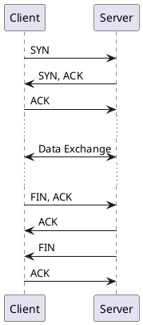
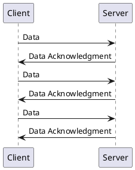

Welcome to another blog post on networking! Today, we'll be diving into the world of UDP (User Datagram Protocol) and TCP (Transmission Control Protocol). These two protocols play a crucial role in how data is transmitted over the internet, and understanding their differences is essential for network administrators, developers, and anyone interested in networking.

## TCP: The Reliable Workhorse

Let's start with TCP, the tried and true protocol that forms the backbone of many internet applications. TCP provides a reliable, connection-oriented communication channel. It ensures that data sent from one device reaches its destination intact, with no loss or corruption.

TCP achieves this reliability through a series of steps called the TCP handshake. The handshake involves a three-way communication between the client and the server. It begins with the client sending a SYN (synchronize) packet to the server, the server responding with a SYN-ACK (synchronize-acknowledgment), and finally, the client sending an ACK (acknowledgment) to complete the handshake.

Once the connection is established, data can be exchanged bidirectionally between the client and the server. TCP guarantees in-order delivery of data, meaning the packets arrive at the destination in the same order they were sent. If a packet is lost or arrives corrupted, TCP will request retransmission until the data is received correctly.

The reliability and error-checking mechanisms of TCP come at a cost: increased overhead and latency. The extensive handshaking and error recovery processes add extra data to each packet and introduce additional round-trip time. This makes TCP ideal for applications that prioritize data integrity and reliability, such as file transfer, web browsing, and email.

## UDP: Speed and Simplicity

On the other hand, UDP offers a lightweight, connectionless transport protocol. Unlike TCP, UDP does not establish a connection before sending data. It simply packages the data into datagrams and sends them to the destination without any guarantees of delivery, ordering, or error-checking.

UDP's simplicity results in lower overhead and faster transmission times compared to TCP. Without the need for extensive handshaking and error recovery, UDP can be highly efficient for applications that require real-time communication or where slight data loss is acceptable, such as video streaming, online gaming, DNS requests, or live audio broadcasting.

However, the lack of reliability means that UDP packets can be lost, arrive out of order, or even be duplicated. It is up to the application layer to handle error correction or retransmission if necessary. While this introduces more complexity for developers, it also offers greater flexibility and control over how data is handled.

## Choosing the Right Protocol

When it comes to deciding between TCP and UDP, it's essential to consider the requirements of your application. If data integrity, reliability, and ordered delivery are paramount, TCP is the way to go. It ensures that your data reaches its destination accurately, even if it comes at the cost of increased latency.

On the other hand, if you prioritize speed, low latency, and are willing to sacrifice some reliability, UDP may be a better fit. UDP allows for faster transmission and is well-suited for applications where real-time communication or rapid data exchange is crucial.

In some cases, applications may even use a combination of TCP and UDP. For example, a video streaming service may use TCP for the initial handshake and control messages, while leveraging UDP for the actual video data to provide a balance between reliability and real-time delivery.

Understanding the differences between TCP and UDP empowers you to make informed decisions when designing and implementing network applications. Consider the specific requirements of your application, weigh the trade-offs, and choose the protocol that aligns best with your needs.

That's it for this blog post! We hope you found this overview of TCP and UDP helpful. Feel free to leave any questions or comments below, and remember to stay tuned for more networking insights in future posts.

Happy networking!
