## Introduction

AWS Cloud offers a vast array of services and features that empower organizations to build scalable and resilient applications. In this post, we will delve into the key concepts and components of AWS Cloud, providing a comprehensive guide to help you navigate through the cloud landscape.

### AWS Accounts and Regions

When you embark on your AWS Cloud journey, you start by creating an AWS account. An AWS account serves as the foundation for all your resources and services within AWS. It provides you with a unique identity and access to a wide range of AWS offerings.

AWS is globally distributed, and its infrastructure is divided into multiple geographic regions. Each region is an independent collection of data centers, interconnected to provide high availability and fault tolerance. Currently, AWS offers regions spread across the globe, including the US, Europe, Asia Pacific, and more.

### Availability Zones (AZs)

Within each region, AWS maintains multiple Availability Zones (AZs). An Availability Zone represents an isolated data center, equipped with redundant power, networking, and cooling infrastructure. The AZs within a region are designed to be independent of each other, ensuring fault tolerance and resilience to failures.

AZs provide organizations with the ability to distribute their resources across multiple physical locations within a region. By deploying resources across different AZs, businesses can enhance availability and protect their applications against localized failures.

### Virtual Private Cloud (VPC)

A Virtual Private Cloud (VPC) is a fundamental building block of AWS Cloud infrastructure. It enables you to create your own isolated virtual network within AWS. With a VPC, you have complete control over your IP address range, subnets, route tables, and network gateways.

When you create an AWS account, a default VPC is automatically provisioned for you in each region. This default VPC simplifies the setup process, providing a starting point for launching your resources. However, you can also create custom VPCs tailored to your specific networking requirements.

To better understand the architecture of a VPC, let's take a look at the following Mermaid diagram:

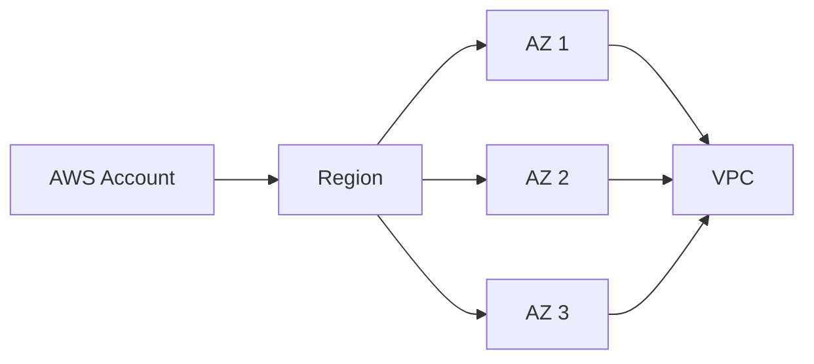

The diagram above illustrates how an AWS account is associated with a region, which, in turn, consists of multiple AZs. Each AZ can host one or more VPCs. This hierarchical structure allows you to build a resilient and highly available network infrastructure within AWS.

Within a VPC, you can create subnets, which are logical subdivisions of the IP address range. Subnets provide isolation and segmentation, allowing you to control the flow of network traffic. Additionally, you can configure route tables to determine how network traffic is directed within the VPC.

### Network Security: NAT, Security Groups, Network ACLs, and Server Firewalls

In AWS Cloud, ensuring network security is of paramount importance. Let's explore the various components that work together to create a secure environment for your resources.

#### Network Address Translation (NAT)

Network Address Translation (NAT) plays a crucial role in allowing instances within a private subnet to communicate with the internet while remaining private. NAT enables outbound internet connectivity for resources in private subnets by performing network address translation for their internet-bound traffic.

AWS offers two options for NAT:

- **NAT Gateway**: NAT Gateway is a fully managed service provided by AWS. It offers high availability, scalability, and automatic scaling. NAT Gateway is the recommended option for most use cases due to its simplicity and resilience.
- **NAT Instance**: NAT Instance is a user-configured EC2 instance that acts as a NAT device. It requires manual configuration and management compared to NAT Gateway.

#### Security Groups

Security Groups act as virtual firewalls at the instance level. They allow you to define rules that control inbound and outbound traffic based on protocols, ports, and IP addresses. Security Groups provide a flexible and scalable way to enforce network security within your VPC.

Key points about Security Groups:

- They are associated with EC2 instances and operate at the instance level.
- You can specify rules to allow or deny traffic based on source IP, destination IP, and ports.
- They are stateful, meaning that if you allow inbound traffic, the corresponding outbound traffic is automatically allowed.
- Security Groups are specific to a VPC and can span multiple AZs within that VPC.

#### Network ACLs (NACLs)

Network ACLs are stateless packet filters that control inbound and outbound traffic at the subnet level. They provide an additional layer of security and operate based on rules that allow or deny traffic based on IP addresses, ports, and protocols.

Key points about Network ACLs:

- They are associated with subnets and

control traffic in both inbound and outbound directions.
- Unlike Security Groups, NACLs are stateless, meaning that you must explicitly allow inbound and outbound traffic separately.
- NACLs evaluate rules in a sequential order, starting from the lowest rule number.
- Rules in NACLs can be used to allow or deny specific types of traffic based on IP addresses, ports, and protocols.

To visualize the relationship between Security Groups and NACLs within a VPC, let's refer to the following Mermaid diagram:

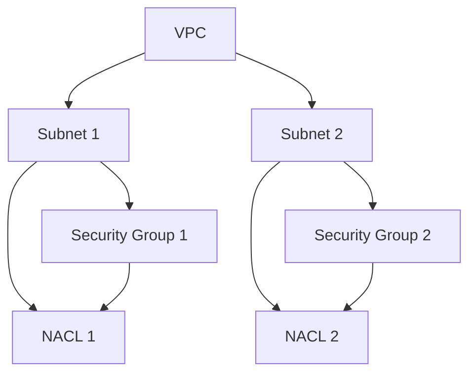

In the diagram above, we can see how the VPC is connected to subnets, Security Groups, and NACLs. The Security Groups and NACLs act as filters, controlling the inbound and outbound traffic to and from the instances.

#### Server Firewalls and Additional Security Measures

In addition to the network-level security components provided by AWS, it is essential to consider server-level firewalls and additional security measures within your EC2 instances.

Within an EC2 instance, you can configure host-based firewalls, such as iptables (for Linux) or Windows Firewall (for Windows), to further control inbound and outbound traffic at the operating system level.

Furthermore, you should regularly update and patch your operating systems and applications to address security vulnerabilities and ensure that you follow security best practices, such as using strong passwords and implementing multi-factor authentication.

### IAM Users, Groups, Roles, and Policies

Managing access to your AWS services and resources is a critical aspect of securing your cloud environment. AWS Identity and Access Management (IAM) provides a robust framework for controlling user permissions. Let's explore the key components of IAM:

#### IAM Users

IAM Users represent individual users or applications within your AWS account. Each IAM User has unique credentials and permissions associated with them. You can create, manage, and delete IAM Users, granting them access to specific AWS services and resources.

#### IAM Groups

IAM Groups are collections of IAM Users. They simplify the management of permissions by allowing you to add or remove users from a group. Permissions can be assigned to IAM Groups collectively, ensuring consistent access control across multiple users.

#### IAM Roles

IAM Roles enable secure delegation of access within AWS. A role is an entity with specific permissions that can be assumed by IAM Users, AWS services, or external entities. IAM Roles define a set of permissions and policies that determine what actions can be performed on AWS resources.

#### IAM Policies

IAM Policies are JSON documents that define permissions for IAM Users, Groups, and Roles. Policies can be attached to IAM identities and specify what actions are allowed or denied on specified AWS resources. IAM Policies are a central component of AWS's access management system, allowing you to control fine-grained access to your resources.

### Internet Gateway

An Internet Gateway is a horizontally scalable and highly available AWS-managed component that enables communication between a VPC and the internet. It serves as a gateway for internet-bound traffic and provides a target for a VPC's default route. An Internet Gateway enables resources within a VPC to connect to the internet, receive public IP addresses, and communicate with other networks on the internet.

To illustrate the role of an Internet Gateway within a VPC, let's refer to the following Mermaid diagram:

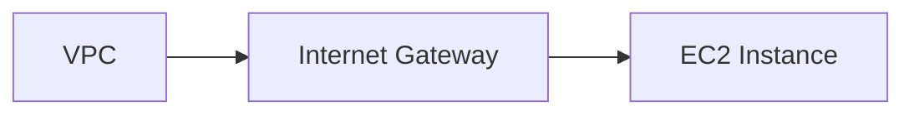

In the diagram above, we can see how the Internet Gateway connects the VPC to the internet, allowing an EC2 instance within the VPC to communicate with external networks.

### NAT Gateway

A NAT Gateway is a managed service provided by AWS that allows instances within a private subnet to access the internet securely. It enables outbound internet connectivity for resources in private subnets by performing network address translation (NAT) for their internet-bound traffic.

To visualize the role of a NAT Gateway within a VPC, let's refer to the following Mermaid diagram:

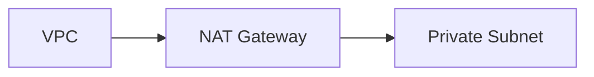

In the diagram above, we can see how the NAT Gateway facilitates outbound internet connectivity for instances within a private subnet.

### Bastion Host

A Bastion Host, also known as a jump host, is a server or EC2 instance that is provisioned to provide secure access to resources within a private network or subnet. It acts as a secure gateway or proxy server that users can connect to in order to access other resources within the private network. Bastion Hosts help protect sensitive resources by providing a controlled access point.

To visualize the role of a Bastion Host within a VPC, let's refer to the following Mermaid diagram:

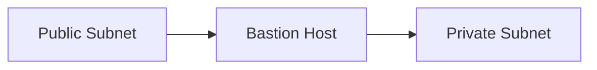

In the diagram above, we can see how the Bastion Host acts as a secure gateway, allowing users to access resources within the private subnet from the public subnet.

### Site-to-Site VPN

A Site-to-Site VPN (Virtual Private Network) is a secure connection established between a company's on-premises network and an AWS VPC. It allows traffic to securely traverse the internet by encrypting and encapsulating it, ensuring privacy and data integrity. Site-to-Site VPNs enable remote users or branch offices to securely access resources within an AWS VPC.

To visualize the Site-to-Site VPN connection between an on-premises network and an AWS VPC, let's refer to the following Mermaid diagram:

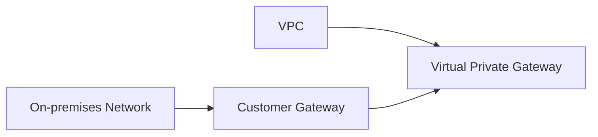

In the diagram above, we can see how the Customer Gateway represents the VPN endpoint on the on-premises network side, while the Virtual Private Gateway serves as the VPN endpoint on the AWS side, enabling secure communication between the two networks.

### Direct Connect

Direct Connect is a network service provided by AWS that establishes a dedicated network connection between an organization's on-premises data center and an AWS Direct Connect location. It provides a private, high-bandwidth, low-latency connection that bypasses the public internet. Direct Connect is useful for scenarios requiring consistent and reliable network performance or for accessing large volumes of data in AWS.

To visualize the Direct Connect connection between an on-premises data center and AWS, let's refer to the following Mermaid diagram:

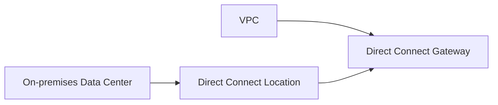

In the diagram above, we can see how the Direct Connect connection provides a private and dedicated network link between the on-premises data center and the AWS VPC, ensuring reliable and secure communication.

### Elastic Load Balancer (ELB) and its Subtypes

Elastic Load Balancer (ELB) is a load balancing service provided by AWS that automatically distributes incoming application traffic across multiple targets to ensure high availability and fault tolerance. AWS offers three subtypes of ELB:

#### Application Load Balancer (ALB)

An Application Load Balancer operates at the application layer (Layer 7) of the OSI model. It intelligently routes traffic to targets based on advanced request routing rules. ALBs are ideal for applications that require granular control over traffic distribution, such as routing based on URL paths, hostnames, or HTTP headers.

To visualize the role of an Application Load Balancer within a VPC, let's refer to the following Mermaid diagram:

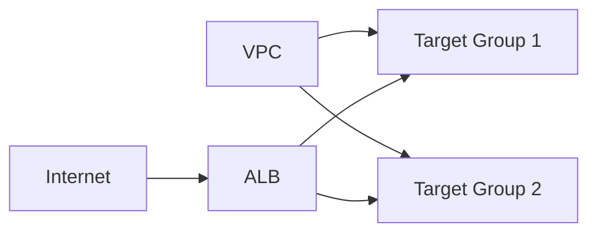

In the diagram above, we can see how the Application Load Balancer routes traffic from the internet to different target groups within the VPC based on the specified routing rules.

#### Gateway Load Balancer (GLB)

A Gateway Load Balancer is designed to load balance traffic to virtual appliances, such as firewalls, intrusion detection systems, and deep packet inspection systems. It allows you to centralize network security and monitoring appliances and efficiently distribute traffic to them.

To visualize the role of a Gateway Load Balancer within a VPC, let's refer to the following Mermaid diagram:

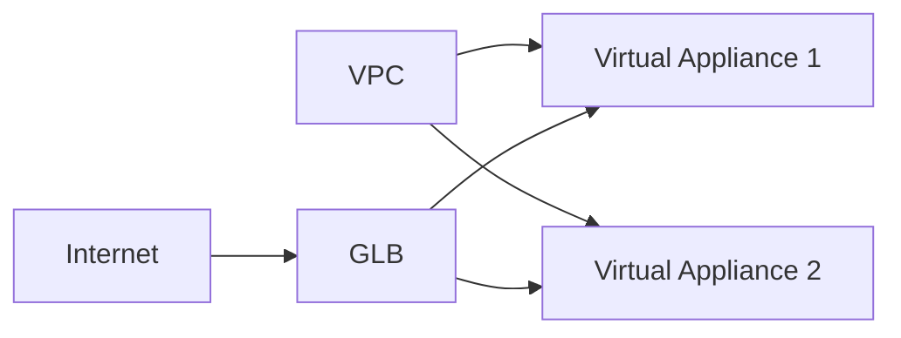

In the diagram above, we can see how the Gateway Load Balancer distributes traffic from the internet to different virtual appliances within the VPC.

#### Network Load Balancer (NLB)

A Network Load Balancer operates at the transport layer (Layer 4) of the OSI model. It is designed to handle high volumes of traffic with low latency. NLBs are ideal for applications that require extreme performance, such as real-time streaming, gaming, and voice-over-IP (VoIP) services.

To visualize the role of a Network Load Balancer within a VPC, let's refer to the following Mermaid diagram:

In the diagram above, we can see how the Network Load Balancer distributes traffic from the internet to different target groups within the VPC based on the transport layer information.

---

With this comprehensive guide, you now have a solid understanding of the key components and concepts of AWS Cloud.

You can leverage AWS Accounts and Regions to organize your resources and benefit from the global infrastructure. Within each region, you can utilize multiple Availability Zones (AZs) to enhance fault tolerance and high availability.

To create your own isolated virtual network within AWS, you can leverage Virtual Private Cloud (VPC). With VPC, you have control over IP address ranges, subnets, route tables, and network gateways.

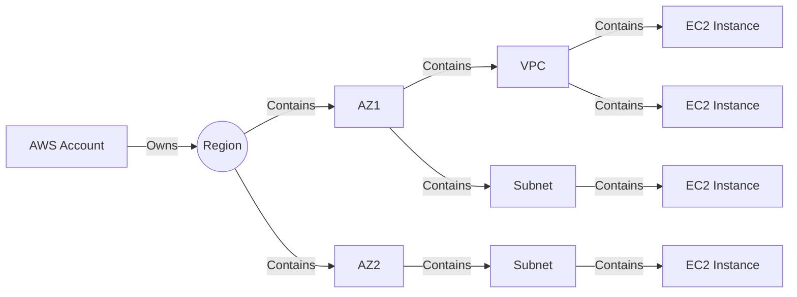

To secure your network within the VPC, you can use various components such as Network Address Translation (NAT) for outbound internet connectivity, Security Groups for instance-level firewall rules, and Network ACLs (NACLs) for subnet-level access control.

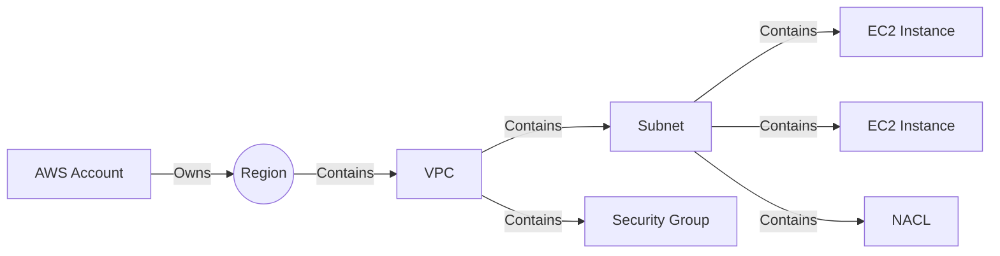

To manage access to your AWS services and resources, you can leverage AWS Identity and Access Management (IAM). IAM Users represent individual users or applications, while IAM Groups simplify permissions management for collections of IAM Users. IAM Roles enable secure delegation of access, and IAM Policies define permissions for IAM entities.

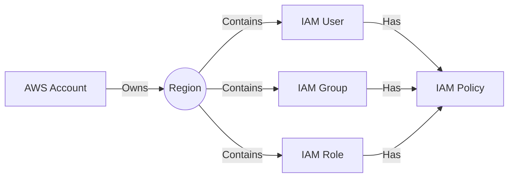

To establish secure connections between your VPC and AWS services without internet access, you can use VPC Endpoints. And if you need to connect multiple VPCs to share resources and enable private communication, you can utilize VPC Peering.

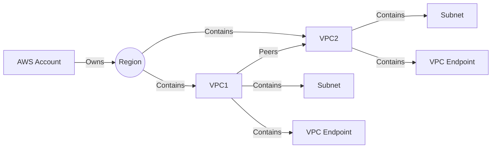

For secure connections between your on-premises networks and AWS VPCs, you can utilize Site-to-Site VPN. It encrypts and encapsulates traffic over the internet, allowing remote users or branch offices to securely access resources within your VPC.

If you require dedicated network connections between your on-premises data center and AWS, you can leverage Direct Connect. It establishes a private and high-bandwidth connection, bypassing the public internet for enhanced network performance.

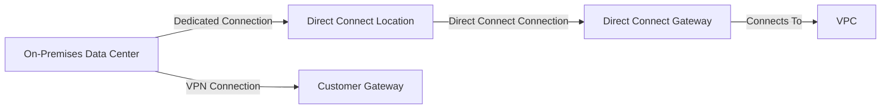

To connect your Direct Connect connections to multiple VPCs in different regions, you can use Direct Connect Gateway. It simplifies network architecture and connectivity for multiple VPCs.

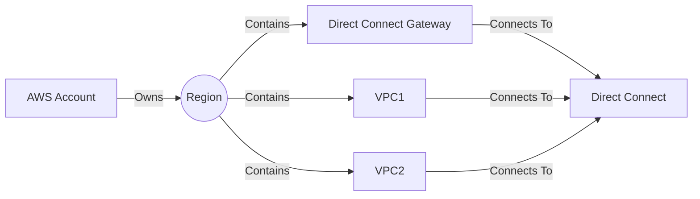

For load balancing your applications and distributing traffic, AWS offers Elastic Load Balancer (ELB) with its subtypes:

#### Application Load Balancer (ALB)
ALB operates at the application layer (Layer 7) and allows advanced request routing based on URL paths, hostnames, or HTTP headers.

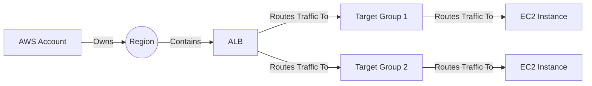

#### Network Load Balancer (NLB)
NLB operates at the transport layer (Layer 4) and is designed for extreme performance and low latency use cases.

#### Gateway Load Balancer (GLB)
GLB is designed to load balance traffic to virtual appliances, centralizing network security and monitoring appliances.

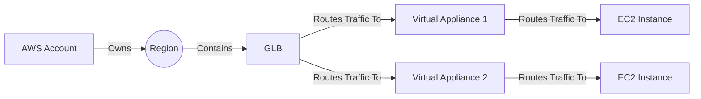

These load balancers help distribute traffic across multiple targets, providing scalability, high availability, and fault tolerance.

In conclusion, AWS Cloud offers a wide range of components and services to build and secure your applications. By leveraging these components effectively, you can create scalable, resilient, and secure architectures to meet your organization's needs.

