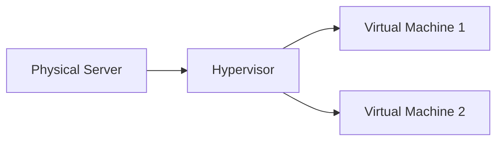
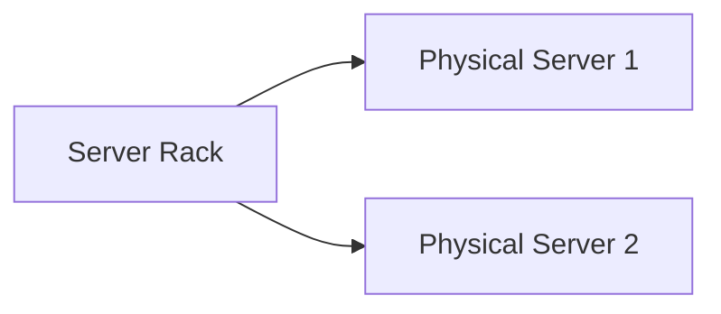
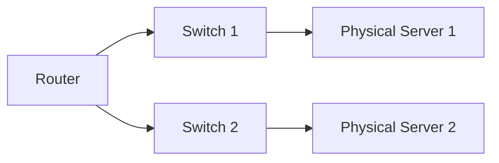
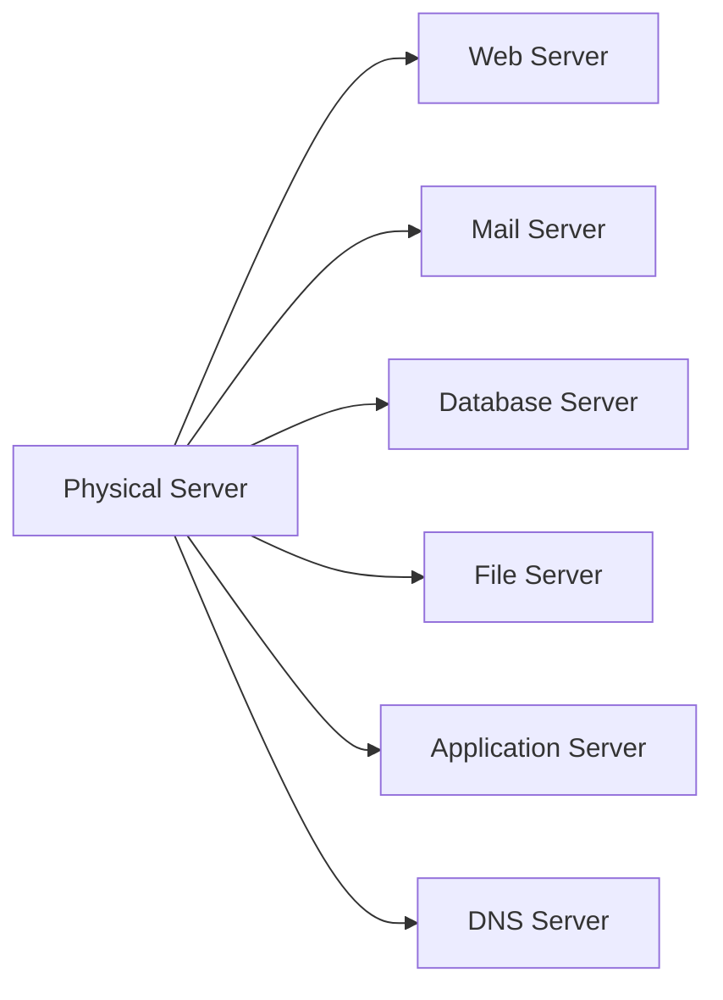

## Introduction

In the realm of computing, physical servers, virtualization, and data centers form a powerful trio that drives modern technology. From running applications to storing and processing data, these components play a crucial role in shaping the digital landscape. In this article, we will delve into the world of physical servers, virtualization, and data centers, exploring their functionalities and the interplay between them.

### Physical Servers: The Foundation

At the core of computing infrastructure, physical servers are dedicated hardware devices designed to process, store, and distribute data and applications. These servers consist of powerful components such as CPUs, RAM, storage devices, and network interfaces. Let's delve deeper into these components:

#### 1. Central Processing Unit (CPU)

The CPU acts as the brain of the server, executing instructions and performing calculations. It is responsible for processing data and managing the overall workload.

#### 2. Random Access Memory (RAM)

RAM provides temporary storage for data that is actively used by the server. It enables quick access to information, allowing applications to run efficiently.

#### 3. Storage Devices

Servers utilize storage devices, such as hard disk drives (HDDs) or solid-state drives (SSDs), to store data persistently. These devices offer varying capacities and performance characteristics.

#### 4. Network Interfaces

Network interfaces connect servers to local networks or the internet, enabling data transmission between servers and external systems.

### Virtualization: The Power of Abstraction

Virtualization is a technology that enables the creation of virtual instances or environments within physical servers. By abstracting the underlying hardware, virtualization allows multiple virtual machines (VMs) or containers to run concurrently on a single physical server. This brings numerous benefits, including resource utilization, workload isolation, and flexibility. Let's explore the key elements of virtualization:

#### 1. Hypervisor

The hypervisor, also known as a virtual machine monitor (VMM), is software that facilitates the creation and management of virtual machines. It abstracts the physical hardware, allowing multiple VMs to run independently on a single physical server.

The Mermaid graph above illustrates the concept of virtualization, with the hypervisor enabling the creation of multiple virtual machines on a single physical server.

#### 2. Virtual Machines

Virtual machines are self-contained instances that mimic the behavior of physical servers. Each VM runs its own operating system and applications, isolated from other VMs on the same physical server.

#### 3. Containers

Containers provide lightweight virtualization, allowing applications to run in isolated environments without the need for a full operating system. Containerization technologies like Docker and Kubernetes have gained significant popularity due to their efficiency and scalability.

### Data Centers: The Powerhouses of Computing

Data centers serve as the homes for physical servers and virtualized environments. These purpose-built facilities provide the infrastructure and resources necessary to support large-scale computing and storage requirements. Let's explore the key aspects of data centers:

#### 1. Server Racks

Data centers house physical servers within server racks, which provide physical support, power distribution, and cooling. Racks organize the servers efficiently and enable easier management and maintenance.

The Mermaid graph above showcases a simplified representation of physical servers housed within a server rack.

#### 2. Cooling Systems

Data centers rely on robust cooling systems to maintain optimal temperatures within the facility. This prevents overheating and ensures that servers operate reliably. Cooling solutions include air conditioning, ventilation, and liquid cooling technologies.

#### 3. Power Supply and Redundancy

Data centers prioritize uninterrupted power supply to keep servers running consistently. They employ multiple power sources, backup generators, and uninterruptible power supply (UPS) systems to ensure continuous availability, even during power outages.

#### 4. Network Infrastructure

Data centers employ a comprehensive network infrastructure to facilitate high-speed data transfer and connectivity. This infrastructure includes routers, switches, and fiber optic cables that interconnect servers within the data center and enable communication with external networks.

The Mermaid graph above depicts a simplified network infrastructure within a data center, with routers and switches connecting physical servers and facilitating data transmission.

#### 5. Security Measures

Data centers implement stringent security measures to protect the physical infrastructure and the data stored within. These measures typically include access control systems, surveillance cameras, fire detection and suppression systems, and robust security protocols.

### Versatility of Servers: Web Servers, Mail Servers, and More

Physical servers can serve various purposes based on their configurations and software setups. Let's explore a few examples of the versatility of servers:

#### 1. Web Server

A web server is a specialized server that hosts websites and delivers web content to clients upon request. It handles HTTP requests, processes them, and sends back the requested web pages to users' web browsers. Web servers run software such as Apache HTTP Server, Nginx, or Microsoft Internet Information Services (IIS) and serve static and dynamic content.

#### 2. Mail Server

A mail server, also known as a mail transfer agent (MTA) or mail exchange server, handles the sending, receiving, and routing of email messages. It uses protocols like SMTP (Simple Mail Transfer Protocol) to send outgoing emails and POP3 (Post Office Protocol 3) or IMAP (Internet Message Access Protocol) to retrieve incoming emails. Popular mail server software includes Postfix, Microsoft Exchange Server, Sendmail, and Exim.

#### 3. Database Server

A database server is a server that stores, manages, and provides access to databases. It runs database management system (DBMS) software such as MySQL, Oracle Database, Microsoft SQL Server, or PostgreSQL. Database servers handle queries, manage data integrity, and ensure the availability of data for applications that rely on databases.

#### 4. File Server

A file server is a server dedicated to storing and sharing files across a network. It provides centralized file storage and allows multiple users or client devices to access files simultaneously. File servers typically run network file system (NFS) or server message block (SMB) protocols for file sharing. Examples include Windows Server with File Server role, FreeNAS, or Samba.

#### 5. Application Server

An application server is a server specifically designed to host and manage applications and related services. It provides the necessary runtime environment and infrastructure for applications to run smoothly. Application servers can support different programming languages and frameworks. Examples include Apache Tomcat, JBoss/WildFly, Microsoft Internet Information Services (IIS), or Node.js.

#### 6. DNS Server

A DNS (Domain Name System) server is responsible for translating domain names into IP addresses. It maintains a database of domain names and their corresponding IP addresses, facilitating the resolution of network requests. Popular DNS server software includes BIND (Berkeley Internet Name Domain), Microsoft DNS Server, and PowerDNS.

These are just a few examples of how physical servers can be versatile and adapted for different purposes. Each server type serves a specific function, providing essential services to support various applications and network infrastructures.

The Mermaid graph above represents a generalized configuration where a physical server can be utilized for multiple purposes simultaneously, such as hosting a web server, mail server, database server, file server, application server, and DNS server.

The versatility of physical servers allows businesses and organizations to optimize their infrastructure based on specific needs, ensuring efficient utilization of resources and enabling a wide range of applications and services.

### The Power of Integration

Physical servers, virtualization, and data centers work together seamlessly to provide a robust computing environment. Physical servers serve as the foundation, while virtualization enables efficient resource utilization and workload management. Data centers provide the necessary infrastructure, power, cooling, and networking capabilities to support these technologies at scale.

Understanding the intricacies of physical servers, virtualization, and data centers helps us appreciate the underlying infrastructure that enables the digital services we rely on daily. The reliability, scalability, and performance offered by these technologies form the backbone of our digital ecosystem.

In conclusion, physical servers, virtualization, and data centers are key components that drive modern computing. They enable efficient resource utilization, workload isolation, and scalability, ultimately contributing to the seamless experiences we enjoy in the digital realm.
