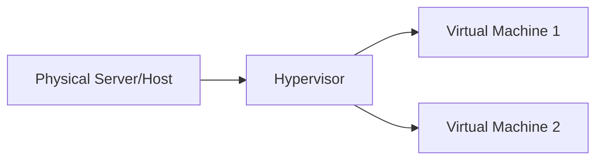
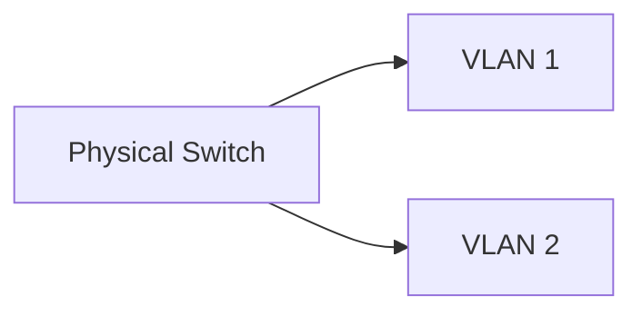
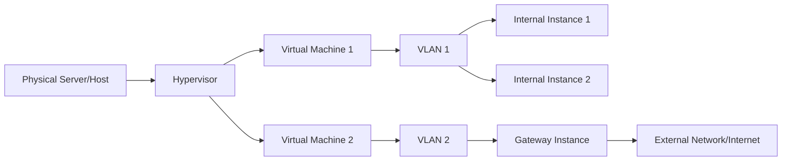

## Introduction

In the realm of computing, virtualization has revolutionized the way we deploy and manage digital infrastructure. By abstracting physical resources and creating virtual environments, organizations can optimize resource utilization, enhance scalability, and streamline operations. In this article, we will delve into the world of virtualization, exploring its functionalities and the benefits it offers, including virtual LANs (VLANs) and other fundamental virtualized components.

### Virtualization: Unlocking the Potential

Virtualization is a technology that enables the creation of virtual instances or environments within physical servers or dedicated virtualization hosts. It abstracts the underlying hardware, allowing for the simultaneous execution of multiple virtual machines (VMs) or containers. Let's explore the key elements of virtualization:

#### 1. Hypervisor

The hypervisor, also known as a virtual machine monitor (VMM), is a software layer that enables the creation and management of virtual machines. It abstracts the physical hardware, allowing multiple VMs to run independently on a single physical server or virtualization host.

The Mermaid graph above illustrates the concept of virtualization, with the hypervisor enabling the creation of multiple virtual machines on a single physical server or virtualization host.

#### 2. Virtual Machines

Virtual machines are self-contained instances that mimic the behavior of physical servers. Each VM runs its own operating system, applications, and services, isolated from other VMs. VMs provide flexibility, scalability, and ease of management.

#### 3. Containers

Containers offer lightweight virtualization, allowing applications to run in isolated environments without the need for a full operating system. Containers share the host's kernel, making them highly efficient and portable. Containerization technologies like Docker and Kubernetes have gained significant popularity due to their efficiency, scalability, and ease of deployment.

### Virtual LANs (VLANs): Enabling Network Segmentation

Virtual LANs (VLANs) are a fundamental component of network virtualization. VLANs enable the logical segmentation of a physical network into multiple virtual networks. This segmentation allows for improved network management, security, and flexibility. Let's explore the key aspects of VLANs:

#### 1. Network Segmentation

VLANs divide a physical network into separate logical networks, even if the devices are connected to the same physical switch. This segmentation enhances network management and facilitates the isolation of network traffic.

The Mermaid graph above represents a scenario where a physical switch is divided into two VLANs, enabling network segmentation.

#### 2. Broadcast Isolation

By implementing VLANs, broadcast domains can be limited to specific VLANs, preventing unnecessary network traffic from propagating across the entire network. This isolation enhances network performance and security.

#### 3. Security and Access Control

VLANs enable the implementation of granular access control policies. Network administrators can restrict access between VLANs, allowing for better security and separation of network resources.

#### 4. Scalability and Flexibility

VLANs provide scalability and flexibility, allowing networks to be easily expanded or reconfigured without physical reconfiguration. New VLANs can be created or modified to meet evolving network requirements.

### Configuring Instances for Communication and Internet Access

Within a virtualized environment, instances can be configured to communicate with one another while allowing only specific instances to connect to the internet. This configuration can be achieved through the use of routing, network address translation (NAT), and security groups. Here's a general approach:

1. **Internal Communication**: Instances that need to communicate with one another can be assigned to the same VLAN or virtual network. This enables direct communication within the virtualized environment, allowing the instances to exchange data and services.

2. **Internet Access**: To provide internet access to specific instances, a dedicated instance, such as a gateway or proxy server, can be configured with two network interfaces—one connected to the internal network (VLAN) and the other connected to the external network (internet). This gateway instance acts as a bridge, allowing traffic from the internal network to access the internet.

3. **Routing and NAT**: The gateway instance performs routing and network address translation (NAT) to forward traffic from internal instances to the external network. It acts as a mediator, translating internal IP addresses to the external IP address assigned to the gateway instance.

4. **Security Groups**: Security groups or firewall rules can be configured to allow specific instances to access the internet while blocking others. This provides granular control over internet connectivity within the virtualized environment.

The Mermaid graph above represents a simplified diagram showcasing instances within a VLAN communicating with each other through a gateway instance that provides internet connectivity.

By configuring instances in this manner, organizations can enable secure and controlled communication within the virtualized environment while restricting internet access to specific instances.

### The Power of Integration: A Comprehensive Virtualized Environment

When integrated, virtualization, VLANs, and instance configuration unlock a comprehensive virtualized environment that offers flexibility, scalability, and efficient resource utilization. The interconnection of these components creates a powerful ecosystem that supports diverse workloads and applications.

Understanding the power of virtualization equips businesses with the knowledge to architect, deploy, and manage their digital infrastructure effectively.

In conclusion, virtualization is a transformative technology that unlocks the potential of virtual environments. By abstracting physical resources, virtualization enables efficient resource utilization, enhances scalability, and simplifies infrastructure management. Incorporating VLANs and configuring instances for communication and internet access further enhances network segmentation, security, and flexibility.

By embracing virtualization, organizations can optimize their digital infrastructure, achieve cost savings, improve operational efficiency, and adapt to the evolving demands of the digital landscape.

Let's bring all these components together in a comprehensive diagram:

The Mermaid diagram above represents a comprehensive virtualized environment. Physical servers or hosts are virtualized using a hypervisor, allowing for the creation of multiple virtual machines (VMs). VLANs are utilized to segment the network, with internal instances assigned to specific VLANs. A gateway instance is configured to provide internet access, acting as a bridge between the internal instances and the external network.

