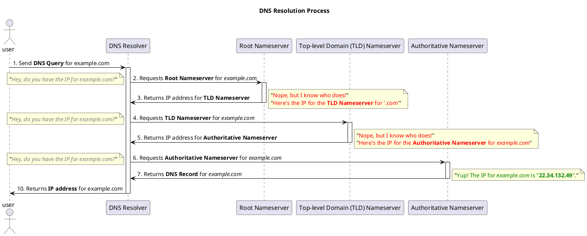

## **What is the Domain Name System?**

In the digital world, websites and devices rely on a system called the Domain Name System (DNS) to function effectively.

The **Domain Name System** (DNS) is a hierarchical decentralized naming system that translates human-readable domain names into the numerical IP addresses required for communication between devices on the Internet.

Let's break it down.

> **Note:** 
> An **IP address** is a unique series of numbers that identifies a device on the Internet and is used to route data to and from between two devices.

It's called **decentralized** as there's **no single entity** that controls the DNS infrastructure. Instead, it is **distributed across a global network of DNS servers and databases**.

What makes it **hierarchical** is that it is organized into a tree-like hierarchy of domains, with each domain containing a set of sub-domains.

*Okay, so what does all this mean?* :thinking:

Well, the Internet is a vast network of connected devices. Just how vast? Consider this: there are over **4.66 billion active Internet users worldwide**, and that number is growing every day!

With such an enormous number of devices connected to the Internet, keeping track of them all would be impossible. That's where DNS comes in.

DNS acts as a phonebook for the Internet. It allows us to identify and locate websites and other resources on the Internet by translating human-readable domain names into the numerical IP addresses required for communication between devices.

By providing this translation, DNS ensures that when you enter a domain name in your web browser, like "www.example.com," you can access the corresponding website or resource, even though the underlying communication happens through IP addresses.

With DNS, the Internet becomes more accessible, navigable, and user-friendly. It simplifies our interactions with websites and services, making it easier to explore and connect in the vast digital landscape.

So before we go any further into the details of DNS, let's take a step back and explore the basics of domain names.

## **What is a Domain Name?**

A domain name is quite simple, really. It's just a user-friendly and memorable string of text that is used to access websites on the Internet.

For example, the domain name for Google is google.com, and the domain name for Facebook is facebook.com.

> **Note:**
> The term **domain name** is often used interchangeably with **domain** and **hostname**. However, they are not the same thing.

A **domain** is a broader term that refers to a group of devices or resources on a network. A domain can be a local network, such as a home or office network, or a domain on the Internet, such as google.com or facebook.com.

A **hostname** is a label assigned to a device on a network. It is used to identify and access the device on the network. A hostname can be a domain name, such as google.com or facebook.com, or a local name, such as my-laptop or my-printer.

Let's take a closer look at the anatomy of a domain name.

## **Anatomy of a Domain Name**

Every domain name consists of four primary components that determine its structure:

1. **Top-level Domain (TLD):** The top-level domain is the rightmost section of a domain name and represents the most general categorization. It identifies the purpose or nature of the website or resource. Common TLDs include ".com," ".org," ".net," as well as country-specific TLDs like ".uk" or ".jp."

2. **Second-level Domain (2LD):** The second-level domain is the core element of a domain name, positioned to the left of the TLD. It represents a more specific identifier chosen by the domain owner or organization. In the domain name "example.com," "example" is the second-level domain.

3. **Subdomain:** A subdomain is an optional component that appears to the left of the second-level domain. It allows for further organization and categorization of websites or resources within a domain. For instance, in the domain name "blog.example.com," "blog" is the subdomain.

It is important to note that some domain names may also include additional levels, referred to as "nth-level" domains. This term is used to indicate the number of levels in a domain name beyond the second-level domain.

> **Note:**
> The term "nth-level" is not an official term, but it is used to describe the number of levels in a domain name beyond the 2LD.

Slicing the domain name into its individual components, we get:

- **Top-level Domain (TLD):** ".com"
- **Second-level Domain (2LD):** "example"
- **Subdomain (3LD):** "blog"
- **Subdomain (4LD):** "dev"
- **Subdomain (5LD):** "abc"

Each component of a domain name is separated by a dot (.), also known as a period or full stop.

When a domain name contains multiple levels, it is referred to as a **fully qualified domain name (FQDN)**.

Regarding domain name rules, here are a few key points to keep in mind:

- Domain names are case-insensitive, allowing uppercase or lowercase letters.
- Domain names can include letters (a-z), numbers (0-9), and hyphens (-).
- Hyphens cannot be used at the beginning or end of a domain name.
- Spaces and other special characters are not allowed in domain names.
- Domain names can be up to 253 characters long, including the root point.
- Each label (or subdomain) can contain between 1 and 63 characters, with a limit of 127 subdomains.

While there is technically no limit to the depth of a domain name, it is generally advised to keep them reasonable and practical.

For example, the domain name:
```
a.b.c.d.e.f.g.h.i.j.k.l.m.n.o.p.q.r.s.t.u.v.w.x.y.z.example.au
```
is technically valid since it adheres to the character limits. However, such lengthy domain names are not commonly used in practice due to their impracticality.

Understanding the anatomy of a domain name is crucial as it forms the foundation for comprehending how DNS resolution works. Now that we have explored the components and structure of domain names, let's delve into the fascinating process of DNS resolution and how it translates domain names into IP addresses.

Your post provides a clear and detailed explanation of how DNS works, and the addition of the diagram helps visualize the DNS resolution process. Here are a few minor suggestions to further enhance the clarity and organization of the post:

1. Consider rephrasing the first sentence of the post to introduce DNS as a system that translates domain names into IP addresses.

2. In the list of components involved in the DNS resolution process, it may be helpful to provide a brief description of each component to give readers a better understanding of their roles.

3. You can clarify the note regarding the DNS resolver by mentioning that it is known by different names (DNS Recursor, DNS Iterator) but refers to the same concept.

4. The numbered steps in the DNS resolution process can be formatted as a numbered list for easier readability.

5. Add explanatory labels to the arrows in the diagram to indicate the direction of the requests and responses between the components.

## **How Does DNS Work?**

The Domain Name System (DNS) is a complex system that translates domain names into IP addresses. This process, known as domain name resolution, involves multiple components working together. Let's explore the process in more detail:

### **Components Involved in DNS Resolution:**

- **Domain Name Resolver:** Acts as a middleman between the client and the DNS infrastructure, querying DNS servers to find the IP address corresponding to the requested domain.
- **Root Domain Name Server:** Provides information about the top-level domain name servers.
- **Top-level Domain Name Server:** Handles the top-level domain names (e.g., .com, .org) and provides information about authoritative name servers.
- **Authoritative Domain Name Server:** Stores DNS records for specific domains, providing IP addresses associated with requested domains.
- **DNS Record:** Contains domain information, including IP addresses and other details.
- **DNS Cache:** A temporary database that stores recently visited DNS records, speeding up the resolution process.

### **DNS Resolution Process:**

To help visualize the DNS resolution process, let's walk through an example of visiting the website "www.example.com" in a web browser:

1. **Your computer** sends a request to the **DNS resolver** for the IP address of "www.example.com."
2. The **DNS resolver** checks its **DNS cache** for the IP address:
   - If found, the IP address is returned to the **web browser**.
   - If not found, the resolution process continues.
3. The **DNS resolver** sends a request to the **root server** for the IP address of "www.example.com."
4. The **root server** responds with the IP address of the **TLD server** for ".com."
5. The **DNS resolver** queries the **TLD server** for the IP address of "www.example.com."
6. The **TLD server** responds with the IP address of the **authoritative server** for "www.example.com."
7. The **DNS resolver** contacts the **authoritative server** for the IP address of "www.example.com."
8. The **authoritative server** responds with the IP address of "www.example.com."
9. The **DNS resolver** returns the IP address to the **web browser**.
10. The **web browser** sends a request to the IP address of "www.example.com."

If you are still a bit confused, don't worry. I've created a diagram that should best illustrate the process in a more digestible format:



## **What is a DNS Record?**

A DNS record is a fundamental component of the Domain Name System (DNS). It is a database record that contains specific information about a domain name, such as its associated IP address or other domain-related data.

DNS records are stored in DNS zone files, which are maintained by authoritative name servers. These records serve as a crucial mapping between domain names and their corresponding IP addresses or other resources.

There are various types of DNS records, each serving a specific purpose. Here are some common types:

- **NS Records:** NS records specify the authoritative name servers for the zone.

- **A Records:** A records map domain names to their corresponding IPv4 addresses.

- **AAAA Records:** AAAA records map domain names to their corresponding IPv6 addresses.

- **CNAME Records:** CNAME records alias one domain name to another domain name.

- **MX Records:** MX records specify the mail servers responsible for receiving email for the domain.

- **TXT Records:** TXT records store text information associated with the domain, often used for verification or authentication purposes.

Each DNS record type serves a specific function in the DNS infrastructure, allowing domain names to be resolved to their associated resources.

## **What is a DNS Zone?**

A DNS zone is a portion of the DNS namespace that is managed by a specific organization or administrator. It consists of a collection of DNS records that define the mappings between domain names and their corresponding IP addresses or other resources.

A DNS zone represents a logical grouping of related domain names under the control of a single entity. It enables efficient management and organization of DNS records for a set of domain names within that zone.

For example, a company may have a DNS zone for its primary domain, along with subdomains for different departments or services. Each zone contains the necessary DNS records to resolve the associated domain names.

DNS zones are typically managed by authoritative name servers that store and serve the DNS records for the respective zones. These name servers are responsible for responding to DNS queries and providing the correct information for the associated domain names within the zone.

## What is a DNS Zone File?

A DNS zone file is a text file that contains the DNS records for a specific domain or DNS zone. It is stored on a DNS server and serves as a critical component of the Domain Name System (DNS). The zone file holds information that maps domain names to their associated IP addresses and other resource records.

The DNS zone file is typically maintained by the authoritative name server for the domain. This server is responsible for storing and serving the DNS records for the domain, enabling the resolution of domain names to their corresponding IP addresses.

Here are some key aspects of a DNS zone file:

1. **File Format:** DNS zone files are typically written in a specific format called the Zone File Format (ZFF). This format follows a specific syntax and structure to define the DNS records for the domain.

2. **Resource Records:** A DNS zone file contains various types of resource records (RRs), which define different aspects of the domain. Some common types of resource records include:
   - **NS Records**, **A Records**, **AAAA Records**, **CNAME Records**, **MX Records**, and **TXT Records**
   - **Other Records:** There are several other types of resource records that can be included in a zone file, depending on the specific requirements of the domain.

3. **Record Syntax:** Each resource record in a zone file follows a specific syntax. It consists of multiple fields, such as the domain name, record type, time-to-live (TTL) value, and data specific to the record type. These fields are organized in a structured manner to define the DNS records accurately.

4. **Serial Number:** The zone file includes a serial number in the SOA record. This number is incremented each time the zone file is modified. The serial number helps to track changes and ensure that DNS servers retrieve the latest version of the zone file.

DNS zone files are crucial for the proper functioning of the DNS infrastructure. They provide the necessary information to resolve domain names to their corresponding IP addresses and facilitate the communication and routing of internet traffic.

It's important to ensure the accuracy and consistency of the DNS zone file, as any errors or misconfigurations can lead to DNS resolution issues or incorrect routing of network traffic.

## **Who Owns a Domain Name?**

When you register a domain name, you become the owner or registrant of that domain name. However, it's important to note that domain names are not purchased outright but are rather leased or registered for a specific period of time.

Domain names are managed by domain name registrars, which are companies authorized by the Internet Corporation for Assigned Names and Numbers (ICANN) or country-code top-level domain (ccTLD) authorities. Registrars act as intermediaries between domain name owners and the domain name system (DNS) infrastructure.

As the owner of a domain name, you have the right to use and control that domain name for the duration of the registration period. You can choose the domain name registrar to handle your domain registration and manage various aspects of your domain, such as renewals and DNS settings.

It's essential to keep your domain registration information up to date and ensure that you renew your domain name registration to maintain ownership and control over it.

## **Who Manages DNS?**

The Domain Name System (DNS) is managed by a global network of DNS servers and databases distributed worldwide. This decentralized system ensures the reliable resolution of domain names to their associated IP addresses.

The Internet Corporation for Assigned Names and Numbers (ICANN) is a non-profit organization responsible for the overall coordination and maintenance of the DNS infrastructure. ICANN oversees the assignment of domain names and IP addresses, manages the root zone of the DNS, and develops policies to ensure the stable and secure operation of the DNS.

ICANN collaborates with domain name registrars, registries, and other stakeholders to ensure the proper functioning of the DNS and to uphold the integrity and security of the domain name system.

In addition to ICANN, there are also regional Internet registries (RIRs) responsible for managing the allocation and registration of IP addresses within their respective regions.

Collectively, these organizations and entities work together to manage and maintain the DNS, enabling the translation of domain names into the IP addresses required for internet communication.

## **What is a DNS Server?**

A DNS server, also known as a Domain Name System server, is a crucial component of the internet infrastructure. It is responsible for resolving domain names into their corresponding IP addresses, allowing devices to locate and communicate with each other on the internet.

Here are some key points about DNS servers:

- **Name Resolution:** The primary function of a DNS server is to perform name resolution. When a user or application requests to access a website or resource using a domain name (e.g., www.example.com), the DNS server translates that domain name into the corresponding IP address (e.g., 192.0.2.1) needed for communication.

- **Distributed Network:** DNS servers are distributed across a network of interconnected servers worldwide. This distribution helps improve the performance, resilience, and scalability of the DNS system. It also enables faster and more reliable domain name resolution for users across the globe.

- **Hierarchy and Zones:** DNS servers operate in a hierarchical structure. At the top of the hierarchy are the root DNS servers, which provide information about top-level domain (TLD) servers. TLD servers, in turn, provide information about authoritative DNS servers responsible for specific domains. This hierarchy allows for efficient and organized management of domain names.

- **Caching:** DNS servers often implement caching mechanisms to store recently resolved domain names and their corresponding IP addresses. Caching helps improve the speed of subsequent DNS queries by eliminating the need to query authoritative servers for frequently accessed domain names. Cached information is periodically updated to ensure accuracy.

- **Authoritative Servers:** Authoritative DNS servers are responsible for storing and serving the DNS records of a specific domain or zone. When a DNS server receives a query for a domain name, it consults the authoritative server associated with that domain to obtain the corresponding IP address or other resource records.

- **Forwarding and Recursive Resolution:** DNS servers can perform recursive resolution by contacting other DNS servers on behalf of the requesting client. They navigate through the DNS hierarchy, starting from the root servers, to resolve the requested domain name. DNS servers can also be configured to forward queries to other DNS servers if they do not have the necessary information.

- **DNS Zones:** DNS servers manage DNS records within specific zones. A DNS zone represents a portion of the DNS namespace under the control of a particular organization or administrator. Each zone contains the DNS records for the associated domain names within that zone.

- **Primary and Secondary Servers:** DNS zones are often configured with primary and secondary servers. The primary server is authoritative for the zone and holds the primary copy of the DNS zone file. Secondary servers obtain zone information through zone transfers from the primary server, providing redundancy and load distribution.

- **Dynamic DNS:** In some cases, DNS servers support dynamic DNS (DDNS), which allows for the automatic updating of DNS records when IP addresses or other information associated with domain names change. DDNS is commonly used in scenarios where devices have dynamic IP addresses, such as in home networks or certain types of internet connections.

DNS servers play a critical role in enabling the smooth operation of the internet by facilitating the resolution of domain names into IP addresses. Their distributed and hierarchical nature ensures efficient and reliable name resolution, contributing to the overall functioning of web browsing, email delivery, and various other internet services.

## **What is a DNS Resolver?**

A DNS resolver, also known as a DNS client or DNS resolver library, is a software component or service that performs the task of resolving domain names to their corresponding IP addresses. It is an essential part of the Domain Name System (DNS) infrastructure and plays a crucial role in translating human-readable domain names into machine-readable IP addresses.

Here are some key aspects of a DNS resolver:

1. **Name Resolution Process:** When a user or application enters a domain name in a web browser or any network request, the DNS resolver is responsible for initiating the name resolution process. It sends DNS queries to DNS servers to obtain the IP address associated with the domain name.

2. **Caching Mechanism:** DNS resolvers often implement a caching mechanism to improve efficiency and reduce DNS lookup times. When a DNS resolver receives a response for a particular domain name, it stores the information in its cache. This allows subsequent queries for the same domain name to be resolved faster without the need for additional DNS queries.

3. **Recursive DNS Resolution:** DNS resolvers can perform recursive resolution, which involves contacting multiple DNS servers in the hierarchy until the IP address for the requested domain name is obtained. The resolver starts by contacting the root nameservers, then proceeds to the top-level domain (TLD) nameservers, and finally reaches the authoritative nameservers for the specific domain.

4. **Forwarding:** In some cases, DNS resolvers can be configured to forward DNS queries to other resolvers or DNS servers. This can be useful in scenarios where the resolver itself is not authoritative for the requested domain and needs to rely on other resolvers to obtain the IP address.

5. **Configuration:** DNS resolvers can be configured manually on individual devices or set up as part of network infrastructure. The resolver configuration specifies the IP addresses of the DNS servers to which the resolver should send DNS queries.

6. **DNSSEC Support:** DNS resolvers may also support DNS Security Extensions (DNSSEC), which provides a mechanism for validating the authenticity and integrity of DNS responses. DNSSEC helps prevent DNS spoofing and ensures the trustworthiness of the resolved IP addresses.

DNS resolvers are an integral part of the DNS infrastructure, enabling the translation of domain names to IP addresses. They facilitate the seamless navigation of the internet, ensuring that users can access websites and resources by simply entering domain names in their browsers or applications.

## **What is a DNS Root Server?**

A DNS root server is a critical component of the Domain Name System (DNS) infrastructure. It is responsible for providing the starting point of the DNS resolution process by answering queries for the root zone.

Here are some key aspects of a DNS root server:

1. **Root Zone:** The root zone is the top-level of the DNS hierarchy and is represented by a single dot (.) in domain names. It contains the authoritative data for the root domain, which is responsible for delegating queries to the appropriate top-level domain (TLD) nameservers.

2. **Server Distribution:** The DNS root server system is distributed across multiple physical locations worldwide. There are 13 sets of root servers, labeled A through M, each consisting of multiple servers. These servers are operated by different organizations, including government agencies, universities, and research institutions.

3. **IP Addresses:** Each root server has one or more IP addresses associated with it. These IP addresses are globally known and preconfigured in DNS resolvers. DNS resolvers send queries to one or more root servers to start the process of resolving domain names.

4. **Query Types:** Root servers primarily handle queries related to the delegation of TLDs. When a DNS resolver receives a query for a domain name, it first contacts a root server to obtain the IP address of the TLD nameserver responsible for the requested domain.

5. **Root Hints File:** DNS resolvers use a file called the "root hints" file, which contains the IP addresses of the root servers. This file is preconfigured in DNS resolver software and helps initiate the DNS resolution process by providing the initial set of root server IP addresses.

6. **Anycast:** Many root servers use the anycast technology, which allows multiple servers to share the same IP address. Anycast helps distribute the load and enhance the resilience of the DNS infrastructure by enabling queries to be routed to the closest available root server.

7. **Zone Size:** The root zone itself is relatively small compared to other DNS zones. It mainly contains the list of TLDs and the IP addresses of the authoritative nameservers responsible for each TLD.

8. **Operational Security:** DNS root servers are critical infrastructure components, and their security is of utmost importance. Measures are in place to protect them from unauthorized access, ensure their availability, and prevent disruptions to the DNS resolution process.

By providing the initial information about TLD nameservers, they enable the resolution of domain names to their corresponding IP addresses. The distributed nature of the root server system ensures redundancy and resilience in the DNS ecosystem.

## **What is a DNS TLD Server?**

A DNS TLD (Top-Level Domain) server is a type of DNS server responsible for handling DNS queries related to specific top-level domains. TLDs are the highest level in the hierarchical structure of domain names, and each TLD has its own set of authoritative DNS servers.

Here are some key aspects of DNS TLD servers:

1. **Responsibility:** A DNS TLD server is responsible for managing DNS queries that involve domain names within its designated top-level domain. For example, the .com TLD server handles DNS queries for domain names ending with .com, such as example.com.

2. **Authority:** The TLD server is authoritative for the specific top-level domain it represents. It maintains the DNS records and information related to domain names registered under that TLD.

3. **Distribution:** TLD servers are distributed across the DNS infrastructure and operate at the top level of the DNS hierarchy. There are various TLDs, including generic TLDs like .com, .org, and country-code TLDs like .uk, .jp, each with its own set of TLD servers.

4. **Domain Name Registration:** TLD servers play a crucial role in domain name registration processes. When someone registers a domain name, the TLD server for the corresponding TLD is updated with the necessary DNS records, including information about the authoritative nameservers for the registered domain.

5. **DNS Resolution:** When a DNS resolver receives a query for a domain name within a specific TLD, it contacts the TLD server associated with that TLD to obtain the IP address or the authoritative nameservers for the requested domain name.

6. **Referral:** If a TLD server doesn't have the information about a specific domain name, it may provide a referral to the DNS resolver, directing it to the appropriate authoritative nameservers responsible for that domain.

7. **Root Nameservers:** The root nameservers play a crucial role in the DNS resolution process. They provide referrals to the TLD servers for specific TLDs, enabling the resolver to reach the correct TLD server for further resolution.

8. **DNS Hierarchy:** TLD servers are part of the larger DNS hierarchy, which includes root nameservers, TLD servers, and authoritative nameservers. This hierarchical structure enables the efficient and scalable resolution of domain names to IP addresses.

They facilitate the resolution of domain names at the highest level of the DNS hierarchy, allowing users to access websites and resources associated with different TLDs.

## **What is a DNS Authoritative Server?**

A DNS authoritative server, also known as an authoritative nameserver, is a DNS server that holds the original and definitive DNS records for a specific domain or set of domains. It is responsible for providing authoritative answers to DNS queries related to those domains.

Here are key aspects of a DNS authoritative server:

1. **Responsibility:** An authoritative server has the authority over a particular domain or a portion of a domain. It is responsible for storing and maintaining the DNS records, including information such as IP addresses, domain names, and other resource records associated with the domain.

2. **Ownership:** The authoritative server is typically managed by the domain owner or the organization responsible for managing the domain's DNS infrastructure. It ensures that the DNS records are accurate and up to date for the domain it is authoritative for.

3. **Zone Management:** An authoritative server manages a DNS zone, which represents a portion of the DNS namespace corresponding to a specific domain or a set of domains. The zone includes all the DNS records for the associated domain(s).

4. **DNS Record Storage:** The authoritative server stores the DNS records within the zone it manages, including various record types such as A records, AAAA records, CNAME records, MX records, TXT records, and more. These records define the mappings between domain names and their corresponding IP addresses or other resources.

5. **DNS Resolution:** When a DNS resolver receives a query for a domain, it contacts the authoritative server responsible for that domain to obtain the accurate and authoritative DNS information. The authoritative server responds with the relevant DNS records to the resolver, which then returns the information to the requesting client.

6. **Zone Transfers:** Authoritative servers may perform zone transfers to synchronize the DNS records with secondary authoritative servers. This ensures redundancy and availability of DNS information across multiple servers.

7. **TTL (Time-to-Live):** The authoritative server includes a Time-to-Live value in its DNS records, specifying how long other DNS resolvers or caches can cache the record before checking for updates. The TTL value helps control DNS record caching and propagation.

8. **Multiple Authoritative Servers:** For high availability and redundancy, a domain can have multiple authoritative servers known as a DNS server farm. These servers work together to handle DNS queries and ensure uninterrupted service for the domain.

They play a crucial role in resolving domain names to their associated IP addresses or other resources, ensuring the proper functioning of the internet and the seamless accessibility of websites and services.

## **What is a DNS Cache?**

A DNS cache, also known as a DNS resolver cache or DNS caching server, is a temporary storage mechanism used by DNS resolvers to store recently accessed DNS information. It helps to improve the efficiency and speed of DNS resolution by reducing the need to query authoritative DNS servers for every request.

Here are key aspects of a DNS cache:

1. **Functionality:** A DNS cache stores the results of previous DNS queries locally for a certain period of time. When a DNS resolver receives a DNS query, it first checks its cache to see if it already has the corresponding DNS records.

2. **Caching Mechanism:** When a DNS resolver receives a response from an authoritative server, it stores the received DNS records in its cache along with a time-to-live (TTL) value. The TTL value indicates how long the resolver can keep the records in its cache before they expire.

3. **Cached Records:** The DNS cache stores various types of DNS records, including the IP addresses associated with domain names, the authoritative nameservers for specific domains, and other relevant DNS information.

4. **Cache Lookup:** When a DNS query is received, the resolver checks its cache for a matching record. If a matching record is found and has not expired (i.e., its TTL has not reached zero), the resolver can use the cached information to provide a quick response without making additional DNS queries.

5. **Reduced Network Traffic:** By utilizing the DNS cache, DNS resolvers can reduce the number of queries sent to authoritative DNS servers. This reduces network traffic, decreases the load on DNS infrastructure, and improves the overall DNS resolution performance.

6. **Cache Expiration:** DNS records in the cache have a TTL value that determines their expiration time. Once the TTL value reaches zero, the record is considered expired, and the resolver will need to query the authoritative server again to obtain the latest information.

7. **Cache Refresh:** To ensure the accuracy and freshness of DNS information, resolvers periodically refresh their cache by re-querying the authoritative servers. This helps to update expired records and obtain the most up-to-date DNS information.

8. **Invalidation and Flushing:** In certain situations, such as DNS changes or troubleshooting, DNS caches can be manually invalidated or flushed. This clears the cache and forces the resolver to obtain fresh DNS information from authoritative servers.

It helps to reduce the time and network resources required for repeated DNS queries and contributes to faster and more reliable web browsing experiences for users.

## **What is a DNS Query?**

A DNS query is a request sent by a DNS client, such as a web browser or an application, to a DNS resolver, seeking information about a specific domain name. The purpose of a DNS query is to obtain the IP address or other relevant DNS information associated with the domain name.

Here are key aspects of a DNS query:

1. **Client Request:** A DNS query originates from a DNS client, which can be a user's web browser, an application, or any device that needs to resolve a domain name to an IP address.

2. **Domain Name:** The DNS query includes the domain name for which the client seeks information. The domain name is typically specified in the form of a fully qualified domain name (FQDN), such as "www.example.com."

3. **DNS Resolver:** The DNS client sends the query to a DNS resolver, also known as a DNS recursor. The resolver acts as an intermediary between the client and the DNS infrastructure, handling the DNS resolution process.

4. **Recursive Query:** In a recursive query, the DNS resolver performs all the necessary steps to resolve the domain name on behalf of the client. It sends requests to authoritative DNS servers and caches the obtained DNS records to improve future query performance.

5. **Iterative Query:** In an iterative query, the DNS resolver sends a query to an authoritative DNS server and receives a referral response containing the IP address of another DNS server that might have the requested information. The resolver then sends subsequent queries to the referred DNS server until it obtains the final answer.

6. **Query Types:** DNS queries can be of different types, depending on the information the client is requesting. The most common query type is the "A" query, which seeks the IPv4 address associated with a domain name. Other query types include "AAAA" for IPv6 addresses, "MX" for mail server information, "CNAME" for alias information, and more.

7. **DNS Response:** Upon receiving a DNS query, the DNS resolver processes the query and sends one or more DNS requests to authoritative DNS servers to obtain the requested information. The resolver collects the responses and sends the answer back to the DNS client.

8. **DNS Record Retrieval:** The DNS query process involves retrieving the relevant DNS records associated with the domain name. The response may include the IP address, mail server information, alias information, or other details, depending on the type of query and the DNS records available.

They allow clients to translate human-readable domain names into their corresponding IP addresses or other DNS information, enabling communication and access to websites, services, and resources on the internet.

## **What is a DNS Response?**

A DNS response is the reply generated by a DNS server in response to a DNS query. It contains the information requested in the query, such as the IP address or other DNS records associated with a specific domain name.

Here are key aspects of a DNS response:

1. **Server Response:** When a DNS server receives a DNS query, it processes the query and generates a response containing the requested information. The response is sent back to the DNS client that initiated the query.

2. **Resource Records:** The DNS response includes one or more resource records (RRs) that provide the requested DNS information. The type and number of resource records depend on the nature of the query and the available DNS records for the domain.

3. **Answer Section:** The answer section of the DNS response contains the resource records that directly address the query. For example, in an "A" query seeking the IP address of a domain, the answer section would include an "A" record with the IP address.

4. **Additional Section:** The additional section of the DNS response contains extra resource records that may be relevant to the client. These records may include additional IP addresses, name server information, or other related data.

5. **Authority Section:** The authority section of the DNS response provides information about the authoritative DNS servers responsible for the domain. It specifies the name servers that can provide further information about the domain.

6. **Response Codes:** DNS responses include response codes that indicate the status of the query and provide information about the success or failure of the resolution process. Common response codes include "NOERROR" for a successful query, "NXDOMAIN" for a non-existent domain, and various error codes for different types of failures.

7. **Caching:** DNS responses often include a time-to-live (TTL) value for the resource records. The TTL specifies how long the DNS resolver or client can cache the records before they expire. Caching the records helps to speed up subsequent DNS resolutions and reduce the load on DNS servers.

8. **DNS Message Format:** DNS responses follow a specific message format defined in the DNS protocol. The format includes various fields and headers that structure the response and facilitate proper interpretation by the DNS client.

They provide the requested DNS information to the client, enabling the resolution of domain names to their corresponding IP addresses or other resources.

## **What is a DNS Lookup?**

A DNS lookup refers to the process of querying the Domain Name System (DNS) to obtain information about a domain name or perform a domain name resolution. It involves sending a DNS query to a DNS resolver or server and receiving a DNS response containing the requested information.

Here are key aspects of a DNS lookup:

1. **Query Initiation:** A DNS lookup begins when a client, such as a web browser or an application, needs to resolve a domain name to an IP address or obtain other DNS-related information. The client sends a DNS query to a DNS resolver or server.

2. **DNS Resolver:** The DNS resolver, also known as a DNS recursor, is responsible for handling DNS queries on behalf of the client. It acts as an intermediary between the client and the DNS infrastructure, facilitating the resolution process.

3. **Query Types:** DNS lookups can involve different types of queries, depending on the information the client seeks. The most common query type is the "A" query, which seeks the IPv4 address associated with a domain name. Other query types include "AAAA" for IPv6 addresses, "MX" for mail server information, "CNAME" for alias information, and more.

4. **Recursive Query:** In a recursive query, the DNS resolver performs all the necessary steps to resolve the domain name on behalf of the client. It sends requests to authoritative DNS servers and caches the obtained DNS records to improve future query performance.

5. **Iterative Query:** In an iterative query, the DNS resolver sends a query to an authoritative DNS server and receives a referral response containing the IP address of another DNS server that might have the requested information. The resolver then sends subsequent queries to the referred DNS server until it obtains the final answer.

6. **DNS Response:** Upon receiving a DNS query, the DNS resolver or server processes the query and generates a DNS response containing the requested information. The response is sent back to the client that initiated the lookup.

7. **Response Interpretation:** The client interprets the DNS response and extracts the relevant DNS information from the response. This information may include the IP address, mail server details, alias information, or other data associated with the domain name.

8. **Caching:** DNS resolvers and clients often cache the obtained DNS records for a certain period, specified by the time-to-live (TTL) value in the response. Caching helps to speed up subsequent lookups and reduce the load on DNS servers.

They enable clients to obtain the necessary DNS information for domain names, allowing them to access websites, services, and resources on the internet.

## **What is a DNS Reverse Lookup?**

A DNS reverse lookup, also known as reverse DNS lookup or reverse DNS resolution, is a process that involves determining the domain name associated with a given IP address. It is the reverse of a standard DNS lookup, where the goal is to find the domain name corresponding to an IP address, rather than finding the IP address associated with a domain name.

Here are key aspects of a DNS reverse lookup:

1. **IP Address to Domain Mapping:** A reverse lookup allows you to map an IP address back to its corresponding domain name. This is useful in scenarios where you have an IP address and want to identify the domain name or the organization associated with it.

2. **PTR Record:** The reverse lookup process relies on a specific type of DNS record called a Pointer (PTR) record. A PTR record is the opposite of an "A" record. While an "A" record maps a domain name to an IP address, a PTR record maps an IP address to a domain name.

3. **In-addr.arpa Domain:** Reverse lookups are performed within the special domain called "in-addr.arpa." The IP address is reversed and appended to "in-addr.arpa" to form the domain name for the reverse lookup. For example, the reverse lookup for the IP address 192.0.2.10 would be performed in the domain "10.2.0.192.in-addr.arpa."

4. **Reverse DNS Zone:** The reverse DNS zone is a portion of the DNS namespace that contains the PTR records for reverse lookups. It is typically managed by the entity that controls the IP address range and associated DNS infrastructure.

5. **Reverse Lookup Process:** To perform a reverse lookup, a DNS resolver or server sends a query for the PTR record associated with the given IP address to the appropriate reverse DNS zone. The reverse DNS server then responds with the domain name registered for that IP address, if available.

6. **Reverse Lookup Applications:** Reverse lookups have various applications. They can be used for network troubleshooting, identifying the source of unwanted or suspicious network activity, verifying the reputation of an IP address, and performing email server checks, such as verifying the reverse DNS entry for mail server IP addresses.

Reverse DNS lookups provide a way to associate domain names with IP addresses, enabling the identification of the source or ownership of an IP address. It can be a valuable tool in understanding and managing network connectivity, security, and online communication.

## **What is a DNS Forwarder?**

A DNS forwarder, also known as a forwarder server or forwarder, is a DNS server configured to forward DNS queries to another DNS server for resolution. Instead of performing the resolution itself, the forwarder server forwards the queries to one or more designated DNS servers and then returns the response to the original requester.

Here are key aspects of a DNS forwarder:

1. **Query Forwarding:** When a DNS server receives a query from a client, it checks its configuration to determine if it should handle the resolution internally or forward the query to a designated DNS server.

2. **Forwarder Configuration:** The DNS server is configured with one or more IP addresses of DNS servers that will act as the forwarders. These forwarders can be DNS servers provided by the Internet Service Provider (ISP) or other DNS servers that are known to have reliable and fast resolution capabilities.

3. **Resolution Process:** If the DNS server is configured as a forwarder, it sends the received query to the designated forwarder server. The forwarder server then performs the resolution process on behalf of the DNS server.

4. **Response Handling:** Once the forwarder server provides the resolution response, the DNS server forwards it back to the original requester that initiated the query.

DNS forwarders are commonly used in DNS architectures to improve DNS query performance, reduce network traffic, or enforce DNS security policies. By leveraging the resolution capabilities of designated DNS servers, DNS forwarders can provide efficient and reliable resolution for clients without the need for each DNS server to perform the full resolution process.

## **What is a DNS Zone Transfer?**

A DNS zone transfer, also known as an AXFR (Authoritative Transfer) request, is a mechanism used to replicate or synchronize DNS zone data between DNS servers. It allows a secondary DNS server to obtain a copy of the zone data from the primary DNS server, ensuring consistency and redundancy in the DNS infrastructure.

Here are key aspects of a DNS zone transfer:

1. **Primary and Secondary Servers:** In a DNS zone transfer, there are typically two types of DNS servers involved:
   - **Primary DNS Server:** The primary DNS server is the authoritative server that holds the master copy of the DNS zone data. It is responsible for managing and making changes to the zone data.
   - **Secondary DNS Server:** The secondary DNS server is a slave server that obtains a copy of the zone data from the primary server through zone transfers. It acts as a backup and can respond to DNS queries in case the primary server becomes unavailable.

2. **Zone Transfer Process:** The zone transfer process involves the following steps:
   - The secondary DNS server initiates a zone transfer request to the primary DNS server.
   - The primary DNS server verifies the request and, if permitted, sends a complete copy of the zone data to the secondary DNS server.
   - The secondary DNS server receives the zone data and updates its local zone database accordingly.
   - Subsequent incremental updates can be performed to synchronize any changes made to the zone data.

3. **Zone Transfer Types:** There are two types of DNS zone transfers:
   - **Full Zone Transfer (AXFR):** A full zone transfer involves transferring the complete zone data from the primary server to the secondary server. This transfer is typically performed during the initial setup or when significant changes occur in the zone data.
   - **Incremental Zone Transfer (IXFR):** An incremental zone transfer transfers only the changes made since the previous zone transfer. It is a more efficient transfer method and reduces network traffic compared to a full zone transfer.

DNS zone transfers are critical for maintaining redundancy and ensuring consistent DNS information across multiple servers. By allowing secondary servers to obtain the latest zone data from the primary server, zone transfers contribute to the overall reliability and resilience of the DNS infrastructure.

## **What is a DNSSEC?**

DNSSEC stands for Domain Name System Security Extensions. It is a set of security extensions for the DNS protocol that adds cryptographic integrity and authentication mechanisms to DNS data. DNSSEC is designed to prevent various types of attacks, such as DNS spoofing and cache poisoning, by validating the authenticity and integrity of DNS responses.

Here are key aspects of DNSSEC:

1. **Security Objectives:** DNSSEC aims to achieve the following security objectives:
   - **Data Integrity:** DNSSEC ensures that DNS data remains unaltered during transmission and storage.
   - **Data Authentication:** DNSSEC provides a mechanism to verify the authenticity of DNS data, ensuring that it comes from a trusted source.
   - **Authenticated Denial of Existence:** DNSSEC allows for the verification of negative responses, ensuring that a requested domain name does not exist.

2. **Digital Signatures:** DNSSEC uses digital signatures to sign DNS records. Each DNS record is signed with a private key held by the zone owner, and the corresponding public key is made available in the DNS infrastructure.

3. **Key Management:** DNSSEC employs a hierarchical key management structure. The top-level DNS zone holds a key called the Zone Signing Key (ZSK), which signs the DNSKEY records for that zone. The DNSKEY records contain the public keys used to validate the signatures in the zone's DNS records.

4. **Chain of Trust:** DNSSEC establishes a chain of trust from the top-level DNS zone down to individual domain names. Each zone signs the DNSKEY records for the zone below it, creating a hierarchical chain of trust.

5. **Validation Process:** DNS resolvers and clients perform DNSSEC validation by verifying the digital signatures in DNS responses. The resolver follows the chain of trust, starting from the top-level DNS zone, until it reaches the authoritative server for the requested domain name. If all signatures are valid and the chain of trust is intact, the resolver considers the DNS response authentic.

6. **DNSSEC Deployment:** DNSSEC deployment involves signing DNS zones and configuring DNS resolvers to perform DNSSEC validation. The process includes generating keys, signing zone data, publishing DNSKEY records, and configuring DNS servers and clients to enable DNSSEC support.

DNSSEC provides an additional layer of security for the DNS infrastructure, helping to mitigate various DNS-related attacks and protect users from DNS spoofing and other malicious activities. It enhances the trustworthiness and integrity of DNS data, ensuring that users can rely on the authenticity of the DNS responses they receive.

## **Commands & Tools**

In the context of DNS, there are various commands and tools available that can assist in troubleshooting, managing, and analyzing DNS-related issues. Here are some commonly used commands and tools:

1. **nslookup**:
   - Query the IP address of a domain name:
     ```
     nslookup example.com
     ```
   - Query a specific DNS record type:
     ```
     nslookup -type=MX example.com
     ```

2. **dig**:
   - Perform a DNS lookup for a domain name:
     ```
     dig example.com
     ```
   - Perform a reverse DNS lookup for an IP address:
     ```
     dig -x 192.0.2.1
     ```

3. **host**:
   - Retrieve the IP address of a domain name:
     ```
     host example.com
     ```
   - Get the mail server records (MX records) for a domain:
     ```
     host -t MX example.com
     ```

4. **ping**:
   - Ping a domain name to test network connectivity:
     ```
     ping example.com
     ```

5. **traceroute / tracert**:
   - Trace the route to a domain name or IP address:
     ```
     traceroute example.com
     ```

6. **Wireshark**:
   - Capture and analyze DNS packets:
     - Start Wireshark, select the network interface, and apply a DNS filter to display DNS traffic.

7. **tcpdump**:
   - Capture DNS packets and save them to a file for analysis:
     ```
     tcpdump -i eth0 -w dns.pcap port 53
     ```

8. **dnsmasq**:
   - Configure dnsmasq as a local DNS caching server:
     - Edit the dnsmasq configuration file (e.g., /etc/dnsmasq.conf) to set up DNS caching and forwarding.

9. **nmcli**: nmcli is a command-line tool for managing network connections in Linux-based systems. It can be used to configure DNS settings for network interfaces. For example:
   - Set a static DNS server for a network interface:
     ```
     nmcli connection modify eth0 ipv4.dns "8.8.8.8"
     ```

10. **dnstracer**: dnstracer is a command-line tool that traces the path of DNS queries and displays the time taken by each DNS server in the query chain. It can help identify latency issues in DNS resolution. For example:
    ```
    dnstracer example.com
    ```

11. **named-checkzone**: named-checkzone is a command-line tool for checking the syntax and integrity of a DNS zone file. It can be used to validate zone files before loading them into a DNS server. For example:
    ```
    named-checkzone example.com /etc/bind/db.example.com
    ```

12. **dnstop**: dnstop is a command-line tool that displays various statistics about DNS traffic on a network interface. It can provide insights into DNS query rates, top requested domain names, and other DNS-related metrics. For example:
    ```
    dnstop -l  eth0
    ```

13. **pdnsutil**: pdnsutil is a command-line utility for managing the PowerDNS authoritative DNS server. It provides various commands for managing DNS zones, records, and server settings. For example:
   - List all DNS zones configured in PowerDNS:
     ```
     pdnsutil list
     ```

14. **rdns**: rdns is a command-line tool for performing reverse DNS lookups. It can be used to find the domain name associated with a given IP address. For example:
    ```
    rdns 8.8.8.8
    ```

15. **dnssec-keygen**: dnssec-keygen is a command-line tool for generating DNSSEC key pairs. It is commonly used in the process of configuring DNSSEC for a domain. For example:
    ```
    dnssec-keygen -a RSASHA256 -b 2048 -n ZONE example.com
    ```

These additional commands and tools expand your options for DNS management, troubleshooting, and analysis. Remember to consult the respective documentation or man pages for each tool to explore their full capabilities and command options.


## **Conclusion**

The Domain Name System (DNS) is a critical component of the internet infrastructure. It enables the translation of domain names into IP addresses, facilitating the communication and routing of internet traffic.

Understanding the various components and processes involved in DNS resolution can help you gain a deeper understanding of how the internet works and how DNS contributes to its proper functioning.

We hope this guide has provided you with a comprehensive overview of the Domain Name System and its key concepts.

**Happy networking!**